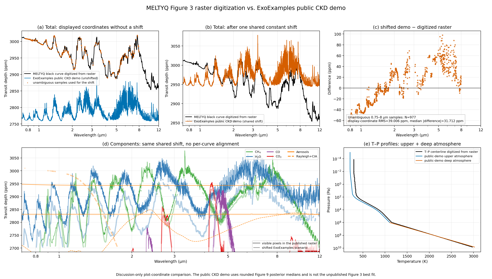

MELTYQ Figure 3 forward model and provisional raster comparison
================================================================

`Japanese master <../../ja/meltyq/meltyq_figure3_forward_preparation_ja.html>`__

Purpose and claim boundary
--------------------------

This implementation follows the physical elements of Figure 3 in the `MELTYQ paper <https://doi.org/10.3847/1538-4357/ae6917>`__ for a K2-18 b transmission forward comparison.
The central `meltyq_figure3.py <https://github.com/HajimeKawahara/exoexamples/blob/main/examples/meltyq/meltyq_figure3.py>`__ joins the magma--deep-atmosphere calculation tested for Figure 8 to an upper atmosphere, opacities, ExoJAX transit radiative transfer, and the bins of public JWST data.

The checked-in :file:`meltyq_figure3_public_demo.json`, however, uses rounded medians read from the published one-dimensional posteriors in Figure 9.
It is a demonstration coordinate, not the unpublished maximum-likelihood vector used for the black Figure 3 curve.
The current numerical output must therefore not be claimed as a reproduction of MELTYQ Figure 3.
This public demo defaults to the ExoJAX-native ``exojax_simpson`` RT path. The TauREx legacy chord and rectangle integration are used as ``taurex_rectangle`` only when an explicit comparison with the MELTYQ discretization is requested.
Pending author-supplied numerical data, the latter part of this document compares the public demo with curves digitized from the published Figure 3 raster for discussion only. The digitization is not a substitute for the author's spectrum and is not used to claim a likelihood or reproduction accuracy.

In a public-demo deep smoke run before evaluating opacities, the boundary, profile, and base solves all converged in 4/3/3 iterations, with :math:`R_{10}=2.336349666\,R_\oplus`, :math:`b_{\rm H_2O}=2.0625\times10^{-2}`, and :math:`b_{\rm CH_4}=3.0685\times10^{-4}`.
H2O is above, and CH4 below, the 0.1--1% description in the paper's Figure 4 discussion.
This is only a pre-opacity demonstration deep state for ``mass_earth=8.63``, an ExoPie radius, the Figure 9 visual reading, and the operational basis mapping; it is not evidence of best-fit agreement.

One path from inputs to observed bins
-------------------------------------

Collect the inputs as

.. math::

   \boldsymbol{\theta}
   = \left(M_p,R_\star,\boldsymbol{\theta}_{\rm magma},
   \boldsymbol{\theta}_{T},\boldsymbol{\theta}_{\rm cloud},
   \boldsymbol{\theta}_{\rm haze},\{\Delta_g\}\right).

The implemented forward map is summarized by one chain:

.. math::

   \boldsymbol{\theta}
   \xrightarrow[\mathrm{ExoEOS/ExoPie}]{\mathrm{ExoGibbs}}
   \left(R_{10},\boldsymbol{b}\right)
   \xrightarrow[\mathrm{opacities}]{T(P),\,x_i(P)=b_i}
   \{\Delta\tau^{(c)}_{\ell q k}\}
   \xrightarrow{\mathrm{ArtTransPure}}
   D^{(c)}_k
   \xrightarrow{\mathrm{bin}+\mathrm{offset}}
   \bar D^{(c)}_j+\Delta_{g(j)} .

Here :math:`R_{10}` is the radius at 10 bar and :math:`\boldsymbol{b}` contains the quenched 10-bar mole fractions of the nine species :math:`(\mathrm{H_2},\mathrm{He},\mathrm{O_2},\mathrm{H_2O},\mathrm{CO},\mathrm{CO_2},\mathrm{CH_4},\mathrm{N_2},\mathrm{NH_3})`.
:math:`\ell` labels a layer, :math:`k` a spectral point, and :math:`q` a CKD :math:`g` ordinate; Diffgrid has no :math:`q` dimension.
:math:`c` labels the total, aerosols, Rayleigh+CIA, or a standalone one-molecule RT scenario.

The equations and solver ownership for magma--gas equilibrium, solubility, the non-ideal deep atmosphere, and integration to the 10-bar radius are documented in :doc:`meltyq_figure8_forward_comparison_en`.
This page starts from its output :math:`(R_{10},\boldsymbol{b})`.
A rocky radius can be supplied explicitly; only an omitted value invokes the external ExoPie package.

The melt-input basis is mandatory in the configuration.
``exogibbs_elemental`` passes the values directly, whereas the public demo's ``paper_labelled_operational_mapping`` applies

.. math::

   C_{\rm provider}=\frac{28.0101}{12.0107}C_{\rm paper},\qquad
   N_{\rm provider}=\frac{28.0134}{14.0067}N_{\rm paper}.

This is an operational mapping that prevents silent identification of different conventions; it is not a claim that the paper contains a typo or bug.

Upper atmosphere
----------------

``ArtTransPure.from_pressure_boundaries`` creates 100 log-pressure layers from :math:`10^{-10}` to 10 bar.
For :math:`s=\log_{10}(P/\mathrm{Pa})`, the layer temperature is linearly interpolated through

.. math::

   (s,T)=(-2,T_{10^{-2}\,\mathrm{Pa}}),\ (2,T_{100\,\mathrm{Pa}}),\
   (4,T_{10^4\,\mathrm{Pa}}),\ (6,T_b).

The atmosphere is isothermal, :math:`T=T_{10^{-2}\,\mathrm{Pa}}`, above :math:`10^{-2}` Pa.
This is the same log-pressure interpolation as TauREx ``NPoint``, followed by a centered moving average set by the configuration value ``smoothing_window_percent``.
For :math:`N` layers and percentage :math:`f`, let :math:`n_0=\lfloor Nf/100\rfloor`; the window :math:`w` is :math:`n_0` when odd and :math:`n_0+1` when even.
For :math:`w>1` and :math:`h=(w-1)/2`, only the interior is replaced:

.. math::

   T_i=\frac{1}{w}\sum_{r=-h}^{h}T^{(0)}_{i+r}
   \qquad (h\le i<N-h),

while the outer :math:`h` layers at each end retain the unsmoothed profile :math:`T^{(0)}`.
The public demo adopts the TauREx default :math:`f=10`; with 100 layers this is an 11-layer moving average with five untouched layers at each end.
The exact percentage used for the MELTYQ Figure 3 run requires author confirmation.

The quench assumption fixes the composition in every layer:

.. math::

   x_i(P)=b_i,\qquad \mu=\sum_i b_i m_i.

The public baseline, ``radiative_transfer_scheme=exojax_simpson``, passes :math:`T(P)`, :math:`\mu`, :math:`R_{10}`, and :math:`g_{10}=GM_p/R_{10}^2` to ExoJAX ``ArtTransPure`` and uses its variable-gravity atmosphere and Simpson annulus integration.
``taurex_rectangle`` is an explicit option used only for MELTYQ compatibility; it selects ``hydrostatic_scheme="layer_constant_gravity"`` to reproduce the TauREx bottom-up Euler recurrence.

Opacities and radiative transfer
--------------------------------

The five molecular line absorbers are H2O, CO, CO2, CH4, and NH3.
Conceptually, the extinction terms are

.. math::

   \alpha_{\rm mol}=\sum_s n_s\sigma_s(\tilde\nu,P,T),\qquad
   \alpha_{\rm CIA}=n_{\rm H_2}^2\sigma_{\rm H_2-H_2}
   +n_{\rm H_2}n_{\rm He}\sigma_{\rm H_2-He},

.. math::

   \alpha_{\rm Ray}=\sum_i n_i\sigma_{{\rm Ray},i}(\tilde\nu).

The public ``exojax_simpson`` path passes each molecular mass fraction :math:`w_s=b_s m_s/\mu` to ExoJAX ``opacity_profile_xs`` or ``opacity_profile_xs_ckd``. In the MELTYQ-compatible ``taurex_rectangle`` path, mole fractions, center number densities, and geometric layer thicknesses form cgs absorber columns that are passed to ExoJAX's layer-opacity API.
CIA includes H2--H2 and H2--He; Rayleigh scattering includes all nine gases.
The ``taurex_rectangle`` compatibility path also follows the outside-range convention of the `pinned TauREx HitranCIA source <https://github.com/ucl-exoplanets/taurex3/blob/7b6e82a86d4675f140e9e59f3d1410a863251c03/src/taurex/cia/hitrancia.py>`__.
Both RT schemes share one explicit ExoJAX contract, ``OpaCIA(cdb, nu_grid=..., wavenumber_interpolation="interp")``.
Although ``OpaCIA.logacia_matrix`` returns log10 values, the native coefficients :math:`k_{qj}` themselves are interpolated in linear coefficient space rather than logarithmic space, first in temperature and then in wavenumber:

.. math::

   k_j(T_i)=\operatorname{lerp}_{T}(T_i;T_q,k_{qj}),
   \qquad
   k_{i\lambda}=\operatorname{lerp}_{\tilde\nu}
   (\tilde\nu_\lambda;\tilde\nu_j,k_j(T_i)).

Outside the native wavenumber range, ``interp`` returns the same constant edge values as ``numpy.interp``.
The public ``exojax_simpson`` path applies an outside-native-range zero mask to that interpolated result. Only the ``taurex_rectangle`` compatibility path keeps the edge values and therefore uses an all-true coverage mask.

The public configuration's ``rayleigh_provider=taurex`` is a code-faithful transcription, retained in ExoExamples, of the `pinned TauREx scattering source <https://github.com/ucl-exoplanets/taurex3/blob/7b6e82a86d4675f140e9e59f3d1410a863251c03/src/taurex/util/scattering.py>`__.
TauREx returns m\ :sup:`2` molecule\ :sup:`-1`; ExoExamples multiplies by :math:`10^4` for its common cm\ :sup:`2` molecule\ :sup:`-1` opacity input and passes that cgs cross section directly to ExoJAX's absorber-column API.
H2 and He have dedicated expressions.
For :math:`\Lambda=10^8/\tilde\nu` in Angstrom, the converted formulas are

.. math::

   \sigma_{\rm H_2}=8.14\times10^{-13}\Lambda^{-4}
   \left(1+1.572\times10^6\Lambda^{-2}
   +1.981\times10^{12}\Lambda^{-4}\right)\ \mathrm{cm^2},

.. math::

   \sigma_{\rm He}=5.484\times10^{-14}\Lambda^{-4}
   \left(1+2.44\times10^5\Lambda^{-2}\right)\ \mathrm{cm^2}.

The other seven gases use TauREx's species-specific refractive index :math:`n_s(\tilde\nu)` and King factor :math:`F_s(\tilde\nu)` in the general expression

.. math::

   \lambda=\frac{10^4}{\tilde\nu}\,10^{-6}\ \mathrm{m},\qquad
   A_s=\frac{n_s^2-1}{N_{\rm ref}(n_s^2+2)},\qquad
   \sigma_s[\mathrm{cm^2}]=10^4\frac{24\pi^3F_sA_s^2}{\lambda^4},

.. math::

   N_{\rm ref}=2.6867805\times10^{25}\ \mathrm{m^{-3}}.

``rayleigh_provider=exojax`` is retained for provider-sensitivity comparisons; it is not the public-comparison default.

For Lee haze, let :math:`a` be particle radius in micron and :math:`\tilde\nu` be wavenumber in cm\ :sup:`-1`:

.. math::

   x=\frac{2\pi a\tilde\nu}{10^4},\qquad
   Q_{\rm ext}=\frac{5}{Q_{\rm LEE}x^{-4}+x^{0.2}},\qquad
   \sigma_{\rm ext}=\pi(a\,10^{-6})^2Q_{\rm ext}.

:math:`P_{\rm LEE}` is interpreted as the center of a full log-pressure width :math:`L`:

.. math::

   P_{\rm top}=P_{\rm LEE}10^{-L/2},\qquad
   P_{\rm bottom}=P_{\rm LEE}10^{L/2}.

With the default :math:`L=2` and ``exp_decay`` profile, the particle number density inside that layer is

.. math::

   n_{\rm haze}(P)=X_{\rm LEE}\left(\frac{P}{P_{\rm bottom}}\right)^5,

and it is zero outside.
These pressure bounds and the :math:`P^5` profile are a code-faithful translation of the currently public TauREx-PyMieScatt source.
However, `commit 2973ace of 2025-05-09 <https://github.com/groningen-exoatmospheres/taurex-pymiescatt/commit/2973acec3985c2222281062be16a07428c43d621>`__ replaced the immediately preceding relation

.. math::

   n_{\rm haze}^{\rm previous}(P)=X_{\rm LEE}
   \left\{1-\exp\left[-5\frac{P-P_{\rm top}}
   {P_{\rm bottom}-P_{\rm top}}\right]\right\}

with the current :math:`P^5` form.
The unresolved provenance therefore includes both the plugin commit and the exact relation used by the MELTYQ Figure 3 run.
Until the authors confirm that provenance, the current public-source relation remains the default and no legacy compatibility option is added.
The code forms the vertical layer depth :math:`n_{\rm haze}\sigma_{\rm ext}\Delta z`; the selected transit scheme then handles the slant geometry.
A ``constant`` profile is also an explicit option.

The gray cloud is a completely opaque deck:

.. math::

   \Delta\tau_{\rm cloud}(P,\lambda)=
   \begin{cases}
   0, & P<P_{\rm cloud},\\
   \infty, & P\ge P_{\rm cloud}.
   \end{cases}

The component helper preserves this mathematical infinity, but the vectorized
chord matrix contains structural zeros for which :math:`0\times\infty` is
NaN.  At the RT boundary only, the implementation therefore replaces it by a
vertical optical depth of :math:`10^{20}`.  This finite representation has
numerically zero transmission and is recorded in :file:`metadata.json`.

Transit geometry and annulus integration
----------------------------------------

The public configuration's ``radiative_transfer_scheme=exojax_simpson`` is the ExoExamples-native path. Pressure-coordinate opacity, physical-shell chord geometry, and annulus integration are owned respectively by the ExoJAX `ArtTransPure source <https://github.com/HajimeKawahara/exojax/blob/develop/src/exojax/rt/trans.py>`__, `chord source <https://github.com/HajimeKawahara/exojax/blob/develop/src/exojax/rt/chord.py>`__, and `radiative-transfer source <https://github.com/HajimeKawahara/exojax/blob/develop/src/exojax/rt/rtransfer.py>`__.

ExoJAX arrays are ordered from top to bottom. To make the equations easy to read, reindex layers bottom-to-top by :math:`i=0,\ldots,N-1`, write the physical radius boundaries as :math:`r_i<r_{i+1}`, the lower and upper pressure boundaries as :math:`P_i^{\rm lev}>P_{i+1}^{\rm lev}`, and let :math:`h_i=r_{i+1}-r_i`. The native variable-gravity atmosphere advances as

.. math::

   g_i=g_{10}\left(\frac{R_{10}}{r_i}\right)^2,
   \qquad H_i=\frac{k_{\rm B}T_i}{\mu_i m_u g_i},

.. math::

   r_{i+1}=\frac{r_i}{1-(H_i/r_i)
   \ln(P_i^{\rm lev}/P_{i+1}^{\rm lev})}.

For molecular mass fraction :math:`w_s=b_s m_s/\mu`, the pressure-column form evaluated by ``opacity_profile_xs`` and ``opacity_profile_xs_ckd`` is

.. math::

   \delta\tau_{s,i\lambda}
   =\sigma_{s,i\lambda}
   \frac{\Delta P_i\,w_s}{m_s m_u g_{i,\rm c}}.

CIA uses ``opacity_profile_cia`` and Rayleigh uses the same cross-section pressure-column API. Only the geometrical haze depth is formed as :math:`\alpha_{i\lambda}h_i` through ``layer_optical_depth_from_extinction``.
:math:`g_{i,\rm c}` is the gravity that ExoJAX evaluates at the layer-midpoint radius, and :math:`\Delta P_i` is the pressure interval in cgs.

For piecewise-constant layer extinction, the length of an impact-parameter :math:`b` ray through shell :math:`j` is

.. math::

   L_j(b)=2\left[
   \sqrt{\max(r_{j+1}^2-b^2,0)}-
   \sqrt{\max(r_j^2-b^2,0)}\right],

.. math::

   \tau_\lambda(b)=\sum_j
   \frac{L_j(b)}{h_j}\,\delta\tau_{j\lambda}.

ExoJAX constructs these chords analytically at the lower boundary :math:`b=r_i` and midpoint :math:`b=r_i+h_i/2`. Defining :math:`F_\lambda(b)=2b[1-\exp(-\tau_\lambda(b))]`, the annulus in each layer is

.. math::

   \int_{r_i}^{r_{i+1}}F_\lambda(b)\,db
   \simeq\frac{h_i}{6}\left[
   F_\lambda(r_i)+4F_\lambda(r_i+h_i/2)+F_\lambda(r_{i+1})
   \right],

.. math::

   R_{\mathrm{eff},\lambda}^2=R_{10}^2+
   \sum_i\int_{r_i}^{r_{i+1}}F_\lambda(b)\,db,
   \qquad
   D_\lambda[\mathrm{ppm}]=10^6
   \frac{R_{\mathrm{eff},\lambda}^2}{R_\star^2}.

At the top boundary :math:`\tau_\lambda(r_N)=0`. For CKD, this calculation is performed at each :math:`g` ordinate before weight averaging.

MELTYQ compatibility path
^^^^^^^^^^^^^^^^^^^^^^^^^

``radiative_transfer_scheme=taurex_rectangle`` is an explicit option used only to compare against the TauREx discretization on which MELTYQ depended; the author template retains this mode. Its comparison specification is the pinned TauREx `planet source <https://github.com/ucl-exoplanets/taurex3/blob/7b6e82a86d4675f140e9e59f3d1410a863251c03/src/taurex/data/planet.py>`__, `simple-model source <https://github.com/ucl-exoplanets/taurex3/blob/7b6e82a86d4675f140e9e59f3d1410a863251c03/src/taurex/model/simplemodel.py>`__, and `TransmissionModel source <https://github.com/ucl-exoplanets/taurex3/blob/7b6e82a86d4675f140e9e59f3d1410a863251c03/src/taurex/model/transmission.py>`__. This TauREx 3.2.0 source pin is a fixed translation reference, not a claim about the unpublished MELTYQ runtime revision.

The hydrostatic recurrence uses ``hydrostatic_radius_profile_ideal_gas`` from ExoJAX ``exojax.atm.atmprof`` with ``hydrostatic_scheme="layer_constant_gravity"``; center number density comes from ``exojax.atm.idealgas.number_density``; and ``layer_optical_depth_from_cross_section``, ``layer_optical_depth_from_log_cia``, and ``layer_optical_depth_from_extinction`` form the vertical depths. Only the base gravity uses the TauREx/Astropy value :math:`G=6.67430\times10^{-8}\ {\rm cm^3\,g^{-1}\,s^{-2}}`; the native path uses the ExoJAX constant.

With bottom-to-top altitude :math:`z_0=0`, this compatibility recurrence is

.. math::

   g_i=g_{10}\left(\frac{R_{10}}{R_{10}+z_i}\right)^2,
   \qquad H_i=\frac{k_{\rm B}T_i}{\mu_i m_u g_i},

.. math::

   \Delta z_i=H_i\ln\frac{P_i^{\rm lev}}{P_{i+1}^{\rm lev}},
   \qquad z_{i+1}=z_i+\Delta z_i.

The center density :math:`n_i=P_i/(k_{\rm B}T_i)` gives

.. math::

   N_{s,i}=b_s n_i\Delta z_i,
   \qquad C_{ab,i}=(b_a n_i)(b_b n_i)\Delta z_i,

.. math::

   \delta\tau_{{\rm mol},i\lambda}
   =\sum_s\sigma_{s,i\lambda}N_{s,i},
   \qquad
   \delta\tau_{{\rm CIA},i\lambda}
   =\sum_{ab}k_{ab,i\lambda}C_{ab,i}.

Here :math:`\sigma` is in cm\ :sup:`2` and :math:`k` is in cm\ :sup:`5`; no extra factor of :math:`1/2` is applied to an identical CIA pair.

For the ``new_path_method=False`` path that TauREx itself names ``compute_path_length_old``, the tangent radius and effective shell boundary are

.. math::

   b_i=R_{10}+\frac{\Delta z_0}{2}+z_i,
   \qquad
   u_j=R_{10}+\frac{\Delta z_0}{2}+z_j+\frac{\Delta z_j}{2},

.. math::

   L_{ij}=\begin{cases}
   0, & j<i,\\
   2\sqrt{u_i^2-b_i^2}, & j=i,\\
   2\left[\sqrt{u_j^2-b_i^2}-\sqrt{u_{j-1}^2-b_i^2}\right], & j>i,
   \end{cases}

.. math::

   \tau_{i\lambda}=\sum_{j=i}^{N-1}
   \frac{L_{ij}}{\Delta z_j}\,\delta\tau_{j\lambda}.

The final rectangle sum is

.. math::

   R_{\mathrm{eff},\lambda}^2=R_{10}^2+
   \sum_{i=0}^{N-1}2(R_{10}+z_i)
   \left(1-e^{-\tau_{i\lambda}}\right)\Delta z_i.

Current TauREx also provides an opt-in ``new_path_method=True`` that uses physical boundaries and each layer midpoint, but the final annulus sum remains the same rectangle and the default remains ``False``. Thus ``taurex_rectangle`` here does not mean a method removed by TauREx; it denotes its MELTYQ-compatible legacy/default path. ExoExamples retains that comparison-specific path but does not use it for the public example's main result.

Two molecular-opacity paths
---------------------------

``ckd``
   This is the runnable ExoMolOP :math:`R\simeq1000` fast path.
   It uses H2O/POKAZATEL, CO/Li2015, CO2/UCL-4000, and CH4/YT34to10.
   Because ExoMolOP does not provide the paper's NH3/BYTe table, this path explicitly substitutes NH3/CoYuTe.
   It adds :math:`k` coefficients at matching :math:`g` ordinates, a perfect-correlation approximation, and is not MELTYQ's :math:`R=50000` cross-section calculation.

``diffgrid``
   This is the paper-line-list-aligned path prepared for the main Figure 3 comparison; it does not assert that every opacity-generation setting matches the paper implementation.
   It reads :math:`R\ge50000` cross sections for H2O/POKAZATEL, CO/Li2015, CO2/UCL-4000, CH4/YT34to10, and NH3/BYTe as ExoJAX ``OpaDiffgrid`` archives on a common wavenumber coordinate and the exact 100-layer pressure grid.
   The exact isotopologues are fixed to ``1H2-16O``, ``12C-16O``, ``12C-16O2``, ``12C-1H4``, and ``14N-1H3``, respectively.
   The archives are not committed. The manifest validates each descriptor's molecule, exact isotopologue, line list, ``teacher_method``, and source-grid minimum resolving power.
   The builder lists the size and SHA-256 of every source/cache file under the line-database directory in the sidecar, and the descriptor also pins the canonical inventory SHA-256.
   It separately verifies the NPZ and companion ``_metadata.json`` sidecar hashes, then checks that archive ``user_meta`` repeats the schema, molecule, isotopologue, line list, and source-grid resolution.
   Besides requiring a common wavenumber grid for all five species, it measures :math:`R_i=\tilde\nu_i/(\tilde\nu_{i+1}-\tilde\nu_i)` from the loaded coordinate and checks consistency with the declared minimum :math:`R=50000`.
   The unfilled manifest template is therefore not executable data.

`meltyq_figure3_build_diffgrid.py <https://github.com/HajimeKawahara/exoexamples/blob/main/examples/meltyq/meltyq_figure3_build_diffgrid.py>`__ is the entry point that builds the archives, sidecars, and manifest.
Each process builds exactly one molecule so that the complete ExoMol ``.trans`` database, PreMODIT teacher, and Diffgrid table can be released before a new process starts the next species.
Acquiring opacity sources requires explicit ``--allow-download`` consent.

The default generation contract is:

* an ESLOG grid over 0.65--12 micron with measured minimum :math:`R\ge50000`; the default has 145,788 points and :math:`R_{\min}\simeq50000.36`;
* the same 100 pressure layers from :math:`10^{-10}` to 10 bar as the upper forward model;
* 21 inverse-temperature nodes from 200 to 1200 K, specifically :math:`T_q^{-1}=1200^{-1}+(q/20)(200^{-1}-1200^{-1})` for :math:`q=0,\ldots,20`;
* H2 as the requested pressure broadener, ``crit=0`` for line-strength selection, and no fallback to a super-line continuum.

ESLOG point counts are obtained with ExoJAX ``nx_even_from_resolution_eslog(..., definition="pointwise")``, and generated coordinates are measured with ``resolution_eslog(..., definition="pointwise")``.
ExoJAX therefore owns the :math:`N-1` intervals, inclusive endpoints, even-point rounding, and pointwise resolving-power definition, while ExoExamples retains the 0.65--12 micron and :math:`R\ge50000` choices, ``nstitch`` divisibility, and manifest gate as comparison policy.

The strict default stops a build when the requested ``H2.broad`` file is absent.
In particular, the public CO/Li2015 source has no H2 broadening file; without this check RADIS silently uses the ``.def`` defaults :math:`\alpha_{\rm ref}=0.07\ {\rm cm^{-1}\,bar^{-1}}` and temperature exponent :math:`n=0.5`.
Only the explicit ``--allow-default-broadening-fallback`` flag permits this approximation, recording requested-file presence, effective source, parameter ranges, and default values in the archive and manifest.
The missing-file policy belongs to the common five-species build contract, so every process contributing to one manifest must use the same flag.
This is a declared public-data approximation pending author confirmation, not a claim that it matches MELTYQ.

With the default ``nstitch=1``, ``OpaPremodit.cutwing`` is a no-op and must not be interpreted as a physical wing cutoff.
When ``nstitch>1`` enables stitch-edge wing truncation, the builder checks that the spectral point count is divisible by ``nstitch`` before any download and records the effective setting in provenance.

Before saving an archive, the builder evaluates the midpoint of every one of the 20 intervals formed by the 21 inverse-temperature nodes, using an isothermal profile over all 100 pressure layers.
Every PreMODIT-teacher and Diffgrid cross section must be finite.
After applying the configured cross-section floor, each of the 20 profiles must satisfy the default gates

.. math::

   \epsilon=\left|\ln \sigma_{\rm Diffgrid}-\ln \sigma_{\rm teacher}\right|,
   \qquad p_{99}(\epsilon)\le0.05,
   \qquad \max(\epsilon)\le0.5.

Failure stops the build before ``saveopa``.
The thresholds can be changed explicitly with ``--maximum-p99-log-cross-section-error`` and ``--maximum-log-cross-section-error``; measured values and the gate are written into the archive provenance.
The loader revalidates the count of all 20 measurements, each inverse-temperature midpoint, finite :math:`p_{99}` and maximum values, and both thresholds; a self-declared ``status=passed`` is insufficient.
ExoJAX ``diffgrid_interval_midpoint_temperatures`` computes the midpoint temperatures, and ``compare_diffgrid_with_teacher`` computes the teacher-error summaries.
ExoJAX reports numerical diagnostics only; ExoExamples owns the thresholds, build rejection, provenance, and load-time revalidation.
This is an opacity-level numerical gate on temperature interpolation, not a guarantee of convergence after observational binning, instrument convolution, or transit-depth integration.

The value and temperature-derivative tables alone require about 4.562 GiB per species, or about 22.8 GiB for all five.
This lower bound excludes the ExoMol transition database, PreMODIT teacher, JAX/XLA temporaries, and archive-compression workspace.
Line counts can dominate: CH4/YT34to10 declares roughly 34 billion transitions, so a full build on an ordinary workstation must not be assumed feasible.

The YT34to10 and BYTe transition files stop at 12,000 cm\ :sup:`-1`, corresponding to 0.833 micron.
A model grid extending to 0.65 micron does not create catalogued CH4 or NH3 lines between 0.65 and 0.833 micron.
BYTe is also an older NH3 list with completeness limitations; following the paper's line-list choice is not a claim that this is the newest or complete NH3 opacity.

A builder-generated manifest stores the exact spectral, pressure, inverse-temperature, teacher, package-version, and ExoJAX Python-source-inventory/Git-revision settings as a common cross-species build contract.
Before the next expensive species build, it compares the canonical float64 SHA-256 of every coordinate array and all settings, including software, with the existing manifest and stops before reading the database on any mismatch.
``--check-inputs`` and the forward loader additionally post-validate the completed archive set.
Inspect ``--dry-run``, ``--help``, and available resources before a real build.

Public JWST data, binning, and offsets
--------------------------------------

Observations are not copied into the repository.
The code explicitly downloads revision 1 assets from the `NIRISS OSF project <https://osf.io/36djh/>`__, `NIRSpec OSF project <https://osf.io/hpu8g/>`__, and `MIRI OSF project <https://osf.io/gmhw3/>`__.
The default selection is low-resolution NIRISS/SOSS; the Hu et al. shifted-average NIRSpec G235H/NRS1, G235H/NRS2, G395H/NRS1, and G395H/NRS2 segments; and MIRI/LRS JExoRES.
The asset SHA-256 values pinned in the manifest are listed below; the four members of the NIRSpec zip are also verified independently.

.. list-table:: Public-asset manifest
   :header-rows: 1
   :widths: 25 75

   * - asset key
     - SHA-256
   * - ``niriss_soss_lowres``
     - ``b4499b16456d19e2b09c35f910a60fbf96d8c14a006fe9f532f17edca051458b``
   * - ``niriss_soss_native``
     - ``779a3511a1f72496429989cf228e6a034d97a80ae506863e3b32a8c6915d64a1``
   * - ``nirspec_hu2025_archive``
     - ``4ee5cb6ad42015bd8fb10f64e54329d250137ab1fa129c89a14830946adc8f18``
   * - ``miri_lrs_jexores``
     - ``fcace11f382706fd474cd27f45b881bfbcf0e4d3042459d1225f846a873b1df1``
   * - ``miri_lrs_jexopipe``
     - ``42db622a0d742e783c632190b0f01baba62be9da1237bb74f453768073d66a87``

An existing cache with a mismatched hash is rejected rather than overwritten, and network access occurs only with ``--fetch-public-data``.

Binning policy depends on opacity mode.
ExoExamples supplies the native and observation-bin edges; ExoJAX constructs the reusable sparse numerical operator and applies it along the spectral axis.
A CKD value :math:`D_b` is a mean over the finite native band bounded by its wavenumber edges, not a point sample at its center.
After converting the edges to wavelength :math:`[\lambda_{b,l},\lambda_{b,u}]`, the observation receives the wavelength overlap

.. math::

   \bar D_j=\sum_b
   \frac{\left|[\lambda_{b,l},\lambda_{b,u}]
   \cap[\lambda_{j,l},\lambda_{j,u}]\right|}
   {\lambda_{j,u}-\lambda_{j,l}}D_b.

The calculation stops unless the native bands completely cover an observation bin; it never interpolates CKD band centers.
ExoJAX ``band_mean_bin_operator`` constructs this finite-band overlap operator.

Only Diffgrid is treated as piecewise linear between point samples and integrated over the archived bin edges with a reusable sparse operator built by ExoJAX ``piecewise_linear_bin_operator``:

.. math::

   \bar D_j=\frac{1}{\lambda_{j,u}-\lambda_{j,l}}
   \int_{\lambda_{j,l}}^{\lambda_{j,u}}D(\lambda)\,d\lambda
   =\sum_k W_{jk}D_k.

Both operators are evaluated in one ``apply_bin_operator`` call over all scenarios and all observation-dataset bins.
Neither operation is a convolution with an instrument LSF or wavelength-dependent throughput.

Offsets never mutate the observations; the model receives :math:`D_{j,\rm model}+\Delta_g` in ppm.
A fixed-offset run uses arbitrary author-supplied values for every group and
does not require an anchor.  Only the public demo adopts the convention of
anchoring NIRISS at zero.  With ``--profile-offsets``, an optional anchor group
remains at its configured value and every other group is profiled analytically:

.. math::

   \widehat\Delta_g=
   \frac{\sum_{j\in g}(D_{j,\rm obs}-D_{j,\rm model})/\sigma_j^2}
        {\sum_{j\in g}1/\sigma_j^2}.

Setting the anchor to ``null`` profiles every group.  This is a
diagonal-Gaussian nuisance profile, not a retrieval.

Component curves and outputs
----------------------------

Following the Figure 3 display, each component is a standalone RT calculation that keeps the same :math:`T(P)`, composition, gravity, and 10-bar radius but includes only the named opacity.
For RT operator :math:`\mathcal R`, the eight scenarios are

.. math::

   D_{\rm total}=\mathcal R\!\left[\Delta\tau_{\rm haze}+\Delta\tau_{\rm cloud}
   +\Delta\tau_{\rm Ray}+\Delta\tau_{\rm CIA}+\sum_s\Delta\tau_s\right],

.. math::

   D_{\rm aerosols}=\mathcal R[\Delta\tau_{\rm haze}+\Delta\tau_{\rm cloud}],
   \qquad
   D_{\rm rayleigh+cia}=\mathcal R[\Delta\tau_{\rm Ray}+\Delta\tau_{\rm CIA}],

.. math::

   D_{{\rm molecule},s}=\mathcal R[\Delta\tau_s],
   \qquad s\in\{\mathrm{H_2O,CO,CO_2,CH_4,NH_3}\}.

Thus ``molecule_H2O`` contains no aerosol, Rayleigh, CIA, or other molecular opacity.
Because :math:`\mathcal R` is nonlinear, standalone curves need not add to the total.

Closing over roughly 22.8 GiB of Diffgrid value and derivative tables could embed them as enormous constants in the RT executable.
The code therefore evaluates temperature-dependent molecular cross sections once outside the RT JIT.
The tables are dynamic arguments of the ExoJAX interpolation JIT, and all five same-shaped species reuse that compiled interpolation.
Only the evaluated layer cross sections, about 0.54 GiB for five species, become dynamic RT arguments.
All eight scenarios are then stacked and evaluated by one JIT-compiled ``jax.vmap``, avoiding both giant table constants in the RT executable and a separate compilation for every component.
CSV output retains all five molecular scenarios including NH3, while the Figure 3-style plot follows the paper display and draws the four H2O, CO, CO2, and CH4 molecular curves, aerosols, Rayleigh+CIA, and the total; it omits only the standalone NH3 curve from the plot.
The output directory contains :file:`model_spectra.csv`, :file:`binned_comparison.csv`, :file:`figure3_forward_comparison.png`, and :file:`metadata.json`.
The black and component curves are intrinsic spectra before dataset offsets;
short model segments in each dataset's color show the values after bin
integration and the corresponding group offset.
Metadata records package versions, deep-solver convergence, opacity provenance and interpolation bounds, data provenance, offsets, residuals, and separate opacity-preparation and RT compile-aware timing.
A full run also records SHA-256 values for the CKD H5 tables, CIA files, and an optional reference CSV.
``memory_estimate`` reports spectral and :math:`g` point counts plus the total Diffgrid archive-table size, the peak resident table under one-species streaming, retained evaluated molecular cross sections, and major float64 RT work arrays.
Its stage-peak lower bound is ``max(one table + retained cross sections, retained cross sections + RT work arrays)``. CIA/Rayleigh arrays, XLA temporaries, and backend allocator overhead are excluded.

Provisional comparison with the published raster
-------------------------------------------------

For discussion pending author-supplied machine-readable spectra, this section digitizes the original Figure 3 PNG, ``f3_Combined_k2-18b.png``, in the source bundle of `arXiv:2605.08752 <https://arxiv.org/abs/2605.08752>`__.
The source is 3597 by 1494 pixels and has SHA-256 ``3ca19cbe480878a8bf67d022cbe2eb6f0caa14733187c6b929a057886575ebe7``.
The article and source artwork are available under the `Creative Commons Attribution 4.0 License <https://creativecommons.org/licenses/by/4.0/>`__.

Unlike the Figure 8 panels, the Figure 3 source is itself a raster and contains no vector path or numerical table.
Strictly speaking, the operation informally called OCR here consists of recognizing the tick labels and then digitizing curves from pixel colors and continuity.
For original-image pixel centers :math:`(x,y)`, least-squares calibration against the printed ticks gives

.. math::

   \log_{10}\!\left(\frac{\lambda}{\mu\mathrm{m}}\right)
   =4.9043699204\times10^{-4}x-0.284569423,

.. math::

   D_{\rm ppm}=3335.438596-0.701754386y,

.. math::

   T[\mathrm{K}]=8.547008547x-25897.435897,
   \qquad
   \log_{10}\!\left(\frac{P}{\mathrm{Pa}}\right)
   =0.0163742690y-4.826900585.

One horizontal pixel corresponds to an approximate resolving power of 885; one vertical spectrum pixel is 0.702 ppm, one horizontal temperature pixel is 8.55 K, and one vertical pressure pixel is 0.0164 dex.

The solid black MELTYQ curve is recovered by a global continuity trace that penalizes vertical steps between adjacent columns, repeated under three penalty values and centered on the local dark stroke.
The output records the spread among those traces and whether a black observational error bar may overlap each column.
Unique exact RGB colors provide visible samples of CH4, H2O, CO, CO2, aerosols, and Rayleigh+CIA; the T--P centerline uses the median dark pixel in each raster row.
The :download:`digitized CSV <../../meltyq/data/meltyq_figure3_raster_reference.csv>` contains 10,245 samples, all under the contract ``published_raster_plot_digitization``.
Of the 2,579 black-curve columns, 246 vary by more than two pixels among the tracing penalties and 1,245 may overlap an error bar.
A component wavelength is absent when the curve is hidden, below the plot range, or in a dashed gap; absence must not be interpreted as zero opacity.

The two sides of this provisional comparison do not use the same calculation conditions.

.. list-table:: Conditions of the provisional comparison
   :header-rows: 1
   :widths: 24 38 38

   * - Item
     - Published Figure 3 raster
     - Current ExoExamples public demo
   * - Parameter point
     - Unpublished maximum-likelihood vector
     - Rounded medians read from the one-dimensional Figure 9 posteriors
   * - Molecular opacity
     - Paper-stated :math:`R=50000` ExoMol cross sections
     - :math:`R\simeq1000` ExoMolOP CKD with matching-:math:`g` perfect correlation
   * - Radiative transfer
     - TauREx
     - ExoJAX ``ArtTransPure(integration="simpson")``
   * - Dataset offsets
     - Retrieved per dataset; application to the raster curve is unconfirmed
     - All configured groups are 0 ppm

The raw absolute transit-depth difference therefore mixes at least the 10-bar radius, stellar radius, dataset-offset convention, and parameter-point differences.
To inspect shape without fitting them, let :math:`S` be the 977 black samples between 0.75 and 8 micron after excluding algorithm-ambiguous columns and possible error-bar overlaps. Apply one common display constant to every ExoExamples scenario,

.. math::

   \Delta_0=-\operatorname{median}_{i\in S}
   \left[D_{\rm ExoExamples}(\lambda_i)-D_{\rm raster}(\lambda_i)\right]
   =+185.716\ \mathrm{ppm}.

This is neither a retrieved offset nor a radius correction; it is only a vertical plot alignment.
Before alignment, ``ExoExamples - raster`` has median -185.716 ppm and RMS 189.461 ppm.
After alignment,

.. math::

   r_i=D_{\rm ExoExamples}(\lambda_i)+\Delta_0-D_{\rm raster}(\lambda_i)

has RMS 39.006 ppm, median absolute residual 31.712 ppm, and maximum absolute residual 97.890 ppm.
These are raster-scale diagnostics between different parameter points and opacity modes, not a likelihood, model error, or MELTYQ reproduction error.

The figure separates the raw total, total and residual after applying only :math:`\Delta_0`, six components, and the T--P profile.
The broad CH4/H2O band structure occurs in similar wavelength regions, but after alignment ExoExamples is on average about 52 ppm lower from 0.75--1 micron, about 47 ppm higher from 4--5 micron, and about 42 ppm higher from 5--8 micron.
The discrepancy therefore includes a broad continuum slope and feature-amplitude differences, not only a constant baseline.
Component comparisons use only visible paper pixels and the same :math:`\Delta_0` for every ExoExamples curve; no component is realigned independently.

The visible discrepancy is strongly sensitive to the Lee-profile revision.
These values come from a one-off sensitivity audit before author confirmation; the older relation has not been added to the public interface. Changing only the relation to the immediately preceding form above, each variant was assigned one median-derived shared shift over the same 977 samples. The display-coordinate RMS against the black curve then decreased from 39.01 to 16.42 ppm, and from 41.59 to 6.34 ppm over 0.75--1.6 micron.
The older relation, however, produces a strong slope in the cloud-plus-Lee scenario that is absent from the orange solid Aerosols curve in the raster.
This agreement therefore does not establish that the paper used the older relation.
The runtime plugin commit, Lee relation, whether the Aerosols curve included Lee haze, and whether total and component curves came from the same run await author confirmation.

For T--P, the public-demo upper atmosphere is mostly colder than the published raster.
Over visible samples at :math:`10^{-4}\le P\le10^6` Pa, ``ExoExamples - raster`` has median -79.6 K and RMS 72.8 K.
The deep linear-log-pressure branch over :math:`10^6\le P\le P_{\rm melt}` is closer, with median -4.4 K and RMS 31.3 K.
This is consistent with the public configuration combining rounded one-dimensional Figure 9 medians rather than using the joint maximum-likelihood T--P curve.

The generated public CKD demo itself returns :math:`R_{10}=2.336350R_\oplus`.
Against the 934 public bins, its zero-offset, diagonal-only residual has RMS 177.512 ppm and :math:`\chi^2/N=9.949` without a parameter-count correction.
This numerically confirms that the demo is not a best fit, but does not rank it against the author run.
The maximum-likelihood vector, exact bulk and radius conditions, retrieved offsets, R50k opacity provenance, H2/He broadening, TauREx discretization, and haze/cloud profile remain confounded.

The reproducible pixel extractor is :file:`docs/meltyq/extract_meltyq_figure3_reference.py`, and the comparison-figure builder is :file:`docs/meltyq/build_meltyq_figure3_raster_comparison.py`.
The :download:`comparison summary <../../meltyq/data/meltyq_figure3_raster_comparison_summary.json>` stores sample selections, hashes, the common shift, residuals, components, and T--P diagnostics.
Once numerical curves arrive from the authors, this raster contract will not be promoted to an author contract; it will be replaced by the ``intrinsic_unoffset_model`` CSV and a filled Diffgrid run described below.

Running and checking
--------------------

Run the first public CKD demo from the repository root. The commands below use the checked-in public configuration and therefore run ExoJAX Simpson.

``--check-inputs`` is a lightweight audit that performs no forward solve and does not materialize the large cross-section tensors.
It verifies public-data paths and pinned SHA-256 values. For each CIA file it checks presence, records the actual SHA-256, and matches the HITRAN header pair identity so that H2-H2 and H2-He cannot be interchanged. Each CKD H5 table is additionally matched to the expected ExoMolOP basename, optional ``mol_name``, and molecular mass, so a table for another species is rejected.
For Diffgrid it hashes each complete NPZ and sidecar, compares descriptors, metadata, and ``user_meta``, and loads only the small ``nu_grid``, ``pressure_grid``, and ``temperature_grid`` arrays needed to validate the common build contract, teacher method, and measured resolving power.
It does not load the large ``log_cross_section_grid`` or derivative tensors, so its memory use is distinct from the full-forward memory estimate.
Both this lightweight path and the full Diffgrid loader require the wavenumber grid to cover both configured 0.65--12 micron endpoints before the deep solve.

.. code-block:: console

   python examples/meltyq/meltyq_figure3.py --check-inputs

.. code-block:: console

   python examples/meltyq/meltyq_figure3.py --fetch-public-data --allow-opacity-download --benchmark-repeats 3

Remove the download flags on subsequent runs:

.. code-block:: console

   python examples/meltyq/meltyq_figure3.py --benchmark-repeats 3

Only when comparing an author-filled configuration against MELTYQ's TauREx discretization, select the legacy configuration explicitly:

.. code-block:: console

   python examples/meltyq/meltyq_figure3.py --config PATH_TO_FILLED_AUTHOR_CONFIG.json

The main comparison with a filled Diffgrid manifest has this form:

.. code-block:: console

   python examples/meltyq/meltyq_figure3.py --opacity-mode diffgrid --diffgrid-manifest PATH_TO_FILLED_MANIFEST.json

Inspect the Diffgrid builder options and explicit-download procedure with:

.. code-block:: console

   python examples/meltyq/meltyq_figure3_build_diffgrid.py --help

For example, to adopt the public-data approximation for CO/Li2015, use the following command and pass the same fallback flag for the other four species in that manifest:

.. code-block:: console

   python examples/meltyq/meltyq_figure3_build_diffgrid.py --species CO --allow-download --allow-default-broadening-fallback

Run network-free unit checks with:

.. code-block:: console

   JAX_PLATFORMS=cpu python -m pytest -q tests

These tests cover formulas, units, hash rejection, bin integration, offsets, and returning every component in one kernel shape.
They do not guarantee a full deep solve or a real-data download.

Author-dependent inputs and reproducibility artifacts
-----------------------------------------------------

The author-dependent part remains separate from forward code:

* Copy :file:`examples/meltyq/configs/meltyq_figure3_author.template.json`, then fill in the exact maximum-likelihood vector for the Figure 3 black curve, fixed bulk values, temperature-smoothing percentage, melt basis, data reductions, and offset values, groups, and signs. It explicitly keeps ``radiative_transfer_scheme=taurex_rectangle`` as the paper-compatibility contract, and cannot run while it contains ``null`` values.
* :file:`examples/meltyq/configs/meltyq_figure3_reference_spectrum.template.csv` has the three columns ``spectrum_contract,wavelength_micron,transit_depth_ppm`` and requires ``spectrum_contract=intrinsic_unoffset_model`` on every row. It therefore contains the author's strictly wavelength-ordered black curve before dataset offsets; offsets exist only in the config. ``--check-inputs`` audits the contract, header, finite values, and ordering; adding ``--reference-spectrum-sha256 64_HEX_DIGITS`` also pins and verifies the file SHA-256.
* For opacities, the author-dependent information is not a Diffgrid manifest file but the exact generation settings and provenance: pressure broadening, wing cutoff, isotope abundance, temperature/pressure/wavenumber grids, teacher method, and related choices.

:file:`examples/meltyq/configs/meltyq_figure3_diffgrid_manifest.template.json` is not an author-dependent artifact.
It is a local reproducibility record generated by the ExoExamples builder from public opacity sources and explicit generation settings, pinning NPZ/sidecar hashes and in-archive provenance.

After receiving the reference curve, add ``--reference-spectrum PATH_TO_REFERENCE.csv`` to a Diffgrid run and, where possible, pin the acquired artifact with ``--reference-spectrum-sha256 EXPECTED_SHA256``.
The code linearly interpolates Diffgrid model point samples to covered reference wavelengths and stores RMS, median absolute, and maximum absolute residuals in ppm in :file:`metadata.json`. CKD native values are finite-band means, so the code explicitly rejects this point-wise reference comparison in CKD mode.

Items still requiring confirmation
----------------------------------

* The Figure 3 maximum-likelihood vector, posterior samples, complete priors, and fixed values.
* Exact stellar and planetary bulk values, rocky-radius relation, and 10-bar radius convention.
* The final mapping between paper-labelled C/N melt inputs and the ExoGibbs provider basis.
* The high-pressure N-solubility form.  Current ExoGibbs follows the primary source's :math:`\sqrt{P}` form, whereas the typeset MELTYQ Appendix shows a linear-:math:`P` form.
* Exact data revisions and reductions, offset grouping, signs, units, and channel covariance.
* Instrument LSF, throughput, and the exact binning procedure used in the paper.
* The exact ``smoothing_window_percent`` used by MELTYQ Figure 3.
* The TauREx-PyMieScatt commit and Lee vertical relation used by MELTYQ Figure 3, whether the orange Aerosols curve included Lee haze, and whether total and component curves came from the same run.
* Pressure broadening, line-wing cutoff, isotope abundance, teacher, and grid-construction provenance of the R50k tables. The current builder requests H2 and stops strictly when its file is absent; only an explicit fallback records and uses ``.def`` defaults.
* Whether the MELTYQ opacity used mixed H2/He broadening.
* A machine-readable copy of the Figure 3 black curve.

These are inputs and provenance that determine the claim level; they do not currently indicate a missing ExoFamily API.

Required ExoFamily changes
--------------------------

The upper-atmosphere, exact spectral-binning, Diffgrid-diagnostics, and pointwise ESLOG grid-sizing APIs required for this migration are now in ExoJAX, and the current implementation needs no additional ExoFamily change.
The ExoExamples-native path uses ExoJAX ``ArtTransPure(integration="simpson")``.
The public ExoGibbs magma/deep solver, ExoEOS density providers, and ExoJAX ``OpaCKD``, ``OpaDiffgrid``, ``OpaCIA``, ideal-gas geometry, layer-opacity, Rayleigh, ``ArtTransPure``, spectral-binning operators, Diffgrid diagnostics, and ESLOG resolution utilities form the complete forward and opacity-preparation chain.
The TauREx-specific Rayleigh formulas, legacy chord/rectangle quadrature, Lee haze, gray cloud, OSF data contract, observation-bin selection, offsets, and reference comparison remain comparison- or example-specific policy in ExoExamples.
ExoJAX provides the numerical integration of piecewise-linear samples and finite-band means.
If author confirmation makes mixed H2/He broadening mandatory, the Diffgrid must be regenerated with either an ExoJAX multi-broadener path that expresses the exact mixture or an external teacher.
This is a conditional fidelity requirement, not a demonstrated ExoFamily API defect.
Only if the author artifacts establish a package-owned gap--for example, that
the high-pressure N-solubility variant must be exposed as a provider
option--should an ExoGibbs change be reported separately with a minimal
reproducible case.
