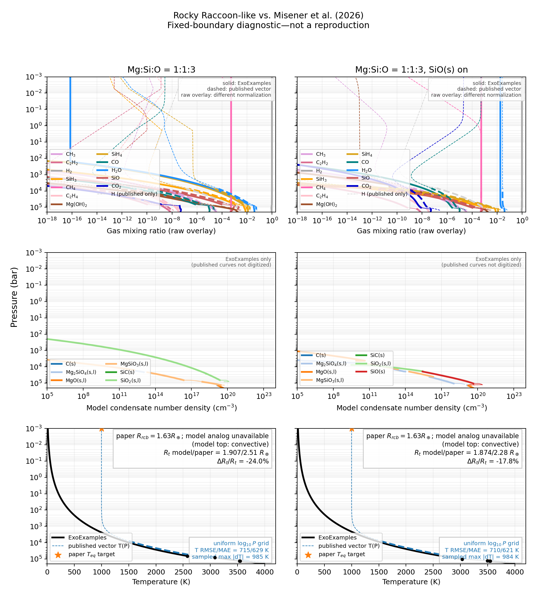

Rocky Raccoon-like deep-envelope column
========================================

`Japanese master edition <../../ja/rocky_raccoon/raccoon_like_forward_ja.html>`__

Purpose and claim boundary
--------------------------

This example implements the ExoExamples side of a Rocky Raccoon-like
chemistry--structure calculation inspired by `Misener et al. (2026)
<https://arxiv.org/abs/2608.24873>`__.  It is an integration benchmark for
ExoGibbs and ExoEOS, not a reproduction of the paper.  Machine-readable
outputs therefore carry the claim
``raccoon_like_not_paper_reproduction``.

The present milestone is deliberately limited to the magma-interface and
deep-atmosphere side of the workflow.  The authoritative CUDA default-grid run
now completes all 1,903 accepted layers with converged equilibria.  This
validates the fixed-boundary implementation at one pressure grid; it is not a
pressure-grid-convergence result.  This example does not adjust missing paper
inputs to reproduce published radii.

Package ownership
-----------------

.. list-table:: Current responsibility split
   :header-rows: 1
   :widths: 20 38 42

   * - Package
     - Used here for
     - Not owned there
   * - ExoExamples
     - Paper-derived species policy, two-candidate branch transaction,
       pressure/radius stepping, constant transport closure, CLI, and outputs
     - Reusable equilibrium or equation-of-state algorithms
   * - ExoGibbs
     - Gas--condensate equilibrium, phase support, conservation audits, and
       rainout composition propagation
     - Structure branch selection
   * - ExoEOS
     - Ideal-mixture density, heat capacity, and adiabatic gradient
     - Paper-specific species selection or transport
   * - ExoJAX
     - Not used in this milestone
     - The later exact upper-boundary stitch and radiative transfer are
       deferred

No ``ExoStructure`` package is introduced.  The coupler remains local to
ExoExamples until genuinely shared structure physics exists.

Exact chemistry contract
------------------------

The five-element configuration minimizes exactly the 70 gas species listed in
Appendix A of the paper.  The canonical preset contains 14 condensates; the
``oxygen_poor_sio`` sensitivity adds ``SiO(s)`` as the fifteenth condensate.
An element-only filter is not used because it would silently admit additional
FastChem catalog species.

The formula matrix has the rows ``H``, ``Mg``, ``Si``, ``O``, ``C``, and
``e-`` and has full row rank.  The ``e-`` row is a charge constraint with zero
inventory; it is not a material element or a gas species.  ExoGibbs minimizes
the 70-species network directly.  In particular, this example does **not**
append neutral atomic gases such as ``H1``, ``Mg1``, ``Si1``, ``O1``, or
``C1``, and it does not append the free-electron gas ``e1-``.  Ions that are
actually present in the Appendix list remain in the network.

The lower-boundary composition is currently prescribed rather than supplied
by magma--gas equilibrium.  Its default number ratios are

.. math::

   \mathrm{Si/H}=10^{-2},\qquad
   \mathrm{Mg/Si}=1,\qquad
   \mathrm{O/Si}=3,\qquad
   \mathrm{C/H}=2.69\times10^{-4}.

The absolute Si/H and C/H choices are inferred model inputs.  All propagated
element vectors use ExoGibbs' normalized composition gauge.  They describe
composition after rainout, not an absolute cumulative mass of retained
elements.

One coupled structure step
--------------------------

At an accepted layer :math:`k`, the coupler owns pressure :math:`P_k`,
temperature :math:`T_k`, radius :math:`r_k`, mean molar mass :math:`\mu_k`,
and normalized incoming element composition :math:`\boldsymbol b_k`.

For :math:`P_{k+1}=qP_k`, it constructs an adiabatic candidate and a
radiative--conductive candidate with the same explicit Euler rule,

.. math::

   T_{k+1}=T_k+(P_{k+1}-P_k)
   \frac{T_k}{P_k}\nabla_T.

Both candidates call ExoGibbs independently with exactly the same
:math:`\boldsymbol b_k`.  Each call proposes its own gas composition,
condensate support, mean molar mass, and outgoing rainout composition.  The
molar-mass gradient is

.. math::

   \nabla_\mu =
   \frac{\ln(\mu_{k+1}/\mu_k)}{\ln(P_{k+1}/P_k)}.

Following Equation (1) of the paper, convection is selected only when

.. math::

   (\nabla_T-\nabla_\mu)_{\mathrm{conv}}
   <
   (\nabla_T-\nabla_\mu)_{\mathrm{nonconv}}.

Equality selects the stable non-convective branch.  Only the selected
candidate's outgoing composition is committed to layer :math:`k+1`; a
rejected candidate cannot alter later layers.  Both candidate equilibria must
converge.  The coupler never hides a failed branch merely because the other
branch converged.

Each solve receives a freshly allocated gas-only numerical hint from the same
accepted parent transition.  The hint records the accepted source
temperature, pressure, and incoming inventory as numerical provenance.
Condensate amounts, support, and rainout output are not included, so ExoGibbs
rediscovers the active phases.  This hint is not a committed physics state,
and the rejected candidate is never used to initialize a later pressure
level.

The amount-gauge conversion of this hint is owned by ExoGibbs through
``regauge_gas_only_warm_start``.  Every finite gas log amount compatible with
the target inventory receives the same additive shift, including values whose
linear amount underflows.  Only absent species and species containing an
exactly depleted physical element receive a finite numerical floor.
ExoExamples adds the accepted source point used by ExoGibbs' bounded inventory
bridge; it does not duplicate the regauging or floor policy.

Radius advances with a lower-state hydrostatic Euler step.  Atmospheric
self-gravity is not included.  ExoEOS ``IdealGas`` supplies density and the
adiabatic gradient using the paper-inspired heat-capacity ratios: 1.3 for
``H4Si1``, 4/3 for ``H2O1``, and 7/5 for the other gases.

The non-convective closure currently uses constant Rosseland opacity
:math:`10^{-2}\,\mathrm{m^2\,kg^{-1}}` and thermal conductivity
:math:`10^3\,\mathrm{W\,m^{-1}\,K^{-1}}` in Equations (4)--(6).  These are
explicit provisional inputs, not the paper's unpublished tabulation.

Experimental axes
-----------------

Three presets are available:

``oxygen_poor``
   Mg:Si:O = 1:1:3 with the canonical 14 condensates.

``oxygen_rich``
   Mg:Si:O = 1:1:4 with the canonical 14 condensates.

``oxygen_poor_sio``
   Mg:Si:O = 1:1:3 with ``SiO(s)`` enabled.

The independent validity modes are:

``paper_extrapolated``
   Remove condensate upper-temperature bounds while retaining the original
   values in output metadata.

``strict_validity``
   Enforce the packaged condensate upper-temperature bounds.

The current validity switch covers condensates only because the packaged gas
setup does not expose equivalent per-species bounds.  Output metadata records
``scope = condensates_only``.

Running the example
-------------------

First inspect the constructed providers without solving equilibrium:

.. code-block:: console

   JAX_PLATFORMS=cpu JAX_ENABLE_X64=1 \
     python examples/rocky_raccoon/raccoon_like_forward.py --check-inputs

The following coarse, three-level deep-column command is the verified runtime
smoke test.  Its pressure ratio of 0.8 is intentionally coarse and must not be
used as a grid-converged scientific result:

.. code-block:: console

   JAX_PLATFORMS=cpu JAX_ENABLE_X64=1 \
     python examples/rocky_raccoon/raccoon_like_forward.py \
       --pressure-top-bar 1.5e5 \
       --transit-pressure-bar 1.6e5 \
       --pressure-ratio 0.8 \
       --output-dir outputs/rocky_raccoon_2026/raccoon_like_forward_smoke

With the provider versions used during development, this accepts the pressure
levels 200000, 160000, and 128000 bar.  All three equilibria converge, and the
accepted condensate support changes from ``MgO(s,l)`` to ``Mg2SiO4(s,l)``.
This observation validates coupling and branch rollback only; it is not a
paper-radius benchmark.  Scientific calculations should return to the default
``pressure_ratio=0.99`` and demonstrate grid convergence.

Successful runs write:

``profiles.csv``
   Named layer quantities, both candidate gradients, all gas and condensate
   values, phase support, and ``normalized_inventory_in/out`` columns.

``summary.json``
   Claim boundary, effective composition, exact species lists, validity
   policy, versions, source provenance, scalar metrics, and convergence
   summaries.  ``hydrogen_to_core_mass_ratio`` uses the fixed gravitating
   core mass as its denominator; it is not the per-layer gas
   ``hydrogen_mass_fraction`` stored in the CSV.

``profile.png``
   Temperature, radius, and density against pressure.  This is a model-run
   diagnostic and is not a comparison with a published figure.

``run_status.json``
   The status of the latest attempt.  It is written as ``running`` before the
   solve and then as ``completed`` or ``failed``.  A failed rerun does not
   delete artifacts from an earlier completed attempt, so consumers must
   require ``status = completed`` before using them.  Package versions and
   scoped source revision, dirty state, and source-inventory hash are recorded
   even for failures.

For a long diagnostic run, ``--accepted-layer-snapshot PATH`` atomically
replaces one NPZ after every committed layer.  It stores named element, gas,
and condensate arrays, the exact gas log amounts, incoming and outgoing
inventories, support, layer coordinates, and source provenance.  If a later
candidate or write fails, the last complete snapshot remains in place and any
partial temporary file is removed.  The snapshot is diagnostic evidence, not
a restart file; ``run_status.json`` remains authoritative for completion.

Resolved ExoGibbs provider boundaries
-------------------------------------

Four exact positive-trace Mg states isolated from the default column now pass
with the current ExoGibbs provider:

* At :math:`T=1334.4049016146876` K and
  :math:`P=6495.780683442079` bar, with normalized Mg inventory
  :math:`1.96\times10^{-14}`, the rainout scheduler preserves the ordinary
  caller amount gauge while the lifecycle alone owns canonical unit-total
  normalization.  A closed finite-barrier state may enter bounded exact polish
  through the initializer-only :math:`10^{-5}` gas-stationarity gate; every
  final physical KKT block remains at :math:`10^{-8}`.
* At :math:`T=1561.8193557386803` K and
  :math:`P=11290.04441816559` bar, a zero-barrier candidate at an optimizer
  evaluation limit is accepted only after the independent positivity,
  stationarity, inactive-support, budget, and total-density certificate passes.
  Such a candidate cannot authorize phase deletion.
* At :math:`T=1269.1589798706555` K and
  :math:`P=5643.1822694059156` bar, with normalized Mg inventory
  :math:`3.77\times10^{-15}`, a bounded alternative-basic-support portfolio
  selects the full-rank ``SiO2(s,l), MgSiO3(s,l)`` basis.  The existing closure
  then certifies the final exact root.
* At :math:`T=1173.1942732095774` K and
  :math:`P=4132.5213914599017` bar, with normalized Mg inventory
  :math:`7.59\times10^{-17}`, an eligible finite-barrier restoration failure
  enters the generic trace-capacity gate.  The preserved pre-PDIPM state may
  initialize one bounded exact zero-barrier closure, and the unchanged
  internal and caller-gauge audits certify the final root.

All four exact states are retained as hard provider regressions.  Exceptions,
ineligible optimizer terminations, non-finite states, and failed physical
blocks remain hard failures.  ExoExamples does not force Mg to zero, change the
pressure grid, propagate condensate support, or ignore a failed thermal
candidate to obtain these results.

Resolving these four one-layer provider boundaries does not by itself certify
the full default column from 200000 to :math:`10^{-3}` bar.

Resolved ExoGibbs trace-capacity boundary
-----------------------------------------

The exact pressure-step-386 state has :math:`T=1173.1942732095774` K,
:math:`P=4132.5213914599017` bar, and normalized Mg inventory
:math:`7.59\times10^{-17}`.  With ExoGibbs merge commit ``2c68aae``, its
finite-barrier solve terminated with ``RESTORATION_MAX_ITER``.

The original finite-barrier support uses ``SiO2(s,l)``,
``MgSiO3(s,l)``, ``MgO(s,l)``, and ``Mg2SiO4(s,l)``.  These four columns have
rank two because

.. math::

   A_{\mathrm{MgSiO_3}} &= A_{\mathrm{SiO_2}} + A_{\mathrm{MgO}},\\
   A_{\mathrm{Mg_2SiO_4}} &= A_{\mathrm{SiO_2}} + 2A_{\mathrm{MgO}}.

Reducing it to a full-rank basis removes the null space but not the more
restrictive trace-capacity condition.  ExoGibbs merge commit ``caf257b``
resolves the state without an ExoExamples workaround.  For a support phase
:math:`j`, ExoGibbs computes the conservative capacity

.. math::

   c_j = \min_{\substack{i \in M\\A^c_{ij}>0}}
         \frac{b_i}{A^c_{ij}},

where :math:`M` contains only monotone conservation rows with non-negative gas
and condensate coefficients.  Signed rows such as charge balance are excluded
because they do not provide an amount ceiling.  If the ordinary terminal-state
initializer is unavailable after an eligible restoration failure and the
support contains a phase whose capacity is at or below the first finite-barrier
amount, the preserved pre-PDIPM state may initialize one bounded exact
zero-barrier closure.

The failed finite-barrier state remains diagnostic evidence and is not itself
accepted.  Final acceptance still requires both the internal zero-barrier and
caller-gauge physical audits at the ordinary :math:`10^{-8}` tolerances.  The
route is selected from restoration status and capacity geometry, not from a
species name, temperature, or pressure.  The exact state is retained as the
hard passing ``test_resolved_default_column_trace_capacity_boundary``
regression.

Resolved ExoGibbs backend-parity regressions
--------------------------------------------

The former A100 GPU pressure-step-378 boundary has
:math:`T=1188.1415292259892` K, :math:`P=4478.5100542051532` bar, normalized
Mg inventory :math:`2.15\times10^{-16}`, and lifecycle outcome
``fixed_support_failed``.

The former CPU pressure-step-380 boundary has :math:`T=1181.3459388985098` K,
:math:`P=4389.3877041264705` bar, normalized Mg inventory
:math:`1.66\times10^{-16}`, and the same ``fixed_support_failed`` outcome.

Current ExoGibbs converges for both exact one-layer inputs.  They are retained
without backend conditions as the hard passing
``test_resolved_default_column_step_378`` and
``test_resolved_default_column_step_380`` regressions.

ExoExamples does not force Mg to zero, change the pressure grid, propagate
condensate support, or ignore a failed convective candidate.

Resolved ExoGibbs guarded-restart boundary
------------------------------------------

Before the current guarded-restart fix, the latest unchanged A100 GPU default
run reached pressure step 698 at :math:`T=480.4777949967222` K,
:math:`P=179.6370128930636` bar, and normalized Mg inventory
:math:`2.403769699\times10^{-46}`.  The exact regression starts from the
accepted parent gas state, matching the column's gas-only warm-start contract.

ExoGibbs now derives capacity regularization only from rows that are monotone
across the joint gas and condensate formula catalogs.  A finite
initializer-relative solve at its evaluation limit, with positive active
amounts but no local KKT certificate, may seed one guarded
dimensionless-unit-scaled restart.  The restarted state is accepted only after
ordinary phase closure and the unchanged full physical and caller-gauge
audits.  The exact warm-parent state is the hard passing
``test_resolved_default_column_step_698_warm_parent`` regression.

The subsequent unchanged A100 run passed this layer and reached pressure step
702 at :math:`T=475.01010900904657` K,
:math:`P=172.55859783339542` bar, and normalized Mg inventory
:math:`6.300502379398082\times10^{-47}`.  At this state, ExoGibbs uses log
residuals for the positive monotone H, Mg, Si, O, and C budgets while retaining
the exactly zero signed charge budget as a scaled linear residual.  The
existing ordered alternative-basic-support portfolio selects support
``(1, 8)`` (``SiO2(s,l)`` and ``MgSiO3(s,l)``), which passes the unchanged
full physical and caller-gauge audits.  This regression deliberately starts
cold and covers the cold fallback that also failed in the column; the
production column tries its independent parent-gas hint first.  The exact
state is the hard passing
``test_resolved_default_column_step_702_mixed_charge_budget`` regression.

Resolved ExoGibbs support-release boundary
------------------------------------------

The next unchanged CUDA default run passed step 702 and stopped at pressure
step 774 at :math:`T=386.57556568831939` K,
:math:`P=83.689430815806617` bar, and normalized Mg inventory
:math:`2.139116395339677\times10^{-56}`.

At this state, the finite-barrier endpoint retains a trace-incompatible
condensate burden.  The basic-support linear program fails, and the bounded
burden-preserving alternative portfolio exhausts its assigned work without a
certificate even though the element-budget gate passes.  ExoGibbs now bounds
that portfolio so that work remains for one generic support-release solve and
the ordinary inactive-phase closure.  A mixed positive-log/signed-linear solve
releases support ``(1, 4)`` to ``(1,)``; ordinary closure then adds phase 8 and
certifies final support ``(1, 8)`` (``SiO2(s,l)``, ``MgSiO3(s,l)``).

Final acceptance retains the unchanged full and caller-gauge physical audits
and the original shared work limit.  The route is selected from support
geometry, portfolio outcome, and available budget, not from a species name,
temperature, or pressure.  The exact state is the hard passing
``test_resolved_default_column_step_774_support_release`` regression.

Resolved ExoGibbs optimizer-directed-release boundary
------------------------------------------------------

The next unchanged CUDA default run passed step 774 and stopped at pressure
step 999 at :math:`T=203.06986826073876` K,
:math:`P=8.7214641233652035` bar, normalized Mg inventory
:math:`1.3681948091591687\times10^{-93}`, and normalized Si inventory
:math:`4.137051394836369\times10^{-84}`.

At this state, the burden-preserving basic-support and alternative-basis
searches do not reach a local root.  A normalized-linear alternative solve has
a negative amount on one phase.  ExoGibbs uses that sign only to select the
original non-negative builder basis as the source for its bounded proper-face
portfolio; rejected terminal amounts are never adopted.  The mixed
positive-log/signed-linear face solve reaches support ``(1, 8)`` and returns to
ordinary inactive-phase closure and the unchanged physical audits.  The exact
state is the hard passing
``test_resolved_default_column_step_999_optimizer_directed_release``
regression.

Resolved ExoGibbs inventory-bridge boundary
--------------------------------------------

The following unchanged default run passed step 999 and stopped at pressure
step 1082 at :math:`T=157.89357053396711` K,
:math:`P=3.7871329378560565` bar, normalized Mg inventory
:math:`6.831754190721877\times10^{-112}`, and normalized Si inventory
:math:`8.328995133274878\times10^{-119}`.

The direct gas-only warm solve cannot enter the basin of physical support
``(9,)``.  Uniform continuation in temperature, pressure, and inventory is not
used because its success was not monotone in step size.  ExoGibbs instead
constructs one inventory midpoint at the exact target temperature and pressure
from the accepted source metadata.  Positive rows are interpolated
logarithmically; rows with a zero endpoint are interpolated linearly.

The midpoint reaches support ``(1, 8)`` and must pass the ordinary lifecycle
and floorless budget certification.  Only its gas state initializes an
exact-target retry, which reaches support ``(9,)`` and passes the same final
audits.  Midpoint condensates, support, and proposed rainout output are
discarded; rainout propagation occurs only once at the exact endpoint.  The
route is bounded by two lifecycle calls, contains no species-specific
condition, and falls back cold if either stage is rejected.  The exact state
is the hard passing ``test_default_column_step_1082_inventory_bridge``
regression.

Resolved post-bridge continuation boundaries
---------------------------------------------

Subsequent unchanged column attempts exposed eight additional warm-parent
boundaries.  The pressure-step indices are grid positions, not the
chronological order in which the reruns exposed them.  Each is now an
unconditional public-provider regression:

.. list-table:: Post-bridge one-layer regressions
   :header-rows: 1
   :widths: 14 52 34

   * - Step
     - Contract exercised
     - Certified condensate support
   * - 1075 and 1084
     - Preserve finite gas log ratios whose linear amounts underflow while
       regauging the accepted parent state to the target inventory.
     - ``(9,)``: ``Mg2SiO4(s,l)``
   * - 1076
     - Retain the positive boundary face in the deterministic basic-support
       candidates.
     - ``(9,)``: ``Mg2SiO4(s,l)``
   * - 1077
     - Solve the first convective warm-parent candidate after committed layer
       1076 without inheriting the competing branch.
     - ``(9,)``: ``Mg2SiO4(s,l)``
   * - 1186
     - Solve the convective sibling-basis transition after committed layer
       1185.
     - ``(5, 8)``: ``Mg(OH)2(s)``, ``MgSiO3(s,l)``
   * - 1342
     - Solve the non-convective warm-parent candidate after committed layer
       1341.
     - ``(1, 5)``: ``SiO2(s,l)``, ``Mg(OH)2(s)``
   * - 1372
     - Certify the convective candidate with a nonzero binary64-subnormal
       silicon inventory after committed layer 1371.
     - ``(5, 1)``: ``Mg(OH)2(s)``, ``SiO2(s,l)``
   * - 1383
     - Conditionally close an exact gas-only candidate from empty condensate
       support after committed layer 1382.
     - ``(5,)``: ``Mg(OH)2(s)``

The support tuples retain the provider's returned ordering; steps 1342 and
1372 have the same support set.  These fixtures preserve accepted-parent gas
logs and source provenance, but they do not propagate parent condensate
amounts or support into the target solve.

At step 1372, :math:`T=69.84723203223899` K,
:math:`P=0.20536053330940687` bar, and the normalized silicon target is
:math:`9.108388204\times10^{-314}`.  Before the correction, a nominally
converged linear candidate missed that target by about 4.83 percent, so the
floorless rainout audit correctly rejected it.  ExoGibbs now audits every
nonzero budget row relative to its exact caller-gauge target, including
binary64-subnormal values, while the exactly zero charge row retains an
absolute scaled residual.  A linear candidate that fails the physical audit
may enter the existing reduced-log-domain support search, but only its final
exact certificate can be accepted.

The corrected public solve passes on CPU and CUDA with support ``(5, 1)``.
The silicon reconstruction is bit-exact and the maximum floorless relative
budget residual is :math:`1.699\times10^{-12}`.

At step 1383 the gas-only candidate has empty condensate support.  If that
candidate fails its caller-gauge physical audit, ExoGibbs conditionally invokes
the existing bounded exact active-set closure from the empty support.  The
closure may add favorable phases, but acceptance still requires the unchanged
full physical and caller-gauge audits.  This generic path has no species- or
step-specific condition; the regression closes on support ``(5,)``.

The authoritative CUDA run in
``outputs/rocky_raccoon_2026/raccoon_like_forward_empty_support_rescue_gpu``
accepted 1,903 layers, all converged.  Its transport counts are 1,879
convective, 23 non-convective, and one base layer; its route counts are 1,462
lifecycle and 441 gas-only layers, with 14 condensate-support changes.  It
reached :math:`P=0.000998090955700085` bar and
:math:`T=15.330699918575274` K.  The transit radius is
:math:`1.9066419361104325\,R_\oplus`.  The previously reported
:math:`1.4805555213405799\,R_\oplus` boundary is a detached
convective-to-non-convective transition: the saved profile becomes convective
again above it.  It is retained only as a legacy transition diagnostic and is
not the paper-analog outer RCB.  Because this column does not end in a
top-connected non-convective region, its paper-analog outer RCB is
unavailable.  These are raccoon-like fixed-grid outputs, not reproduced paper
radii or a pressure-grid-convergence claim.

.. image:: raccoon_like_forward_en_files/raccoon_like_forward_cuda_profile.png
   :alt: Pressure, temperature, and radius profiles from the authoritative raccoon-like CUDA run
   :width: 100%
   :align: center

*Profiles from the authoritative CUDA fixed-grid run.  This image is an
internal model diagnostic, not a comparison with or reproduction of a paper
figure.*

Paper-facing Figure 2 and Figure 5 comparison
----------------------------------------------

``paper_comparison.py`` is a standalone postprocessor for completed forward
runs.  It does not solve chemistry or structure again.  It requires every
input directory to contain a completed ``run_status.json`` and rejects a
running or failed column instead of plotting a partial profile.

The Figure 2 comparison can be generated from the completed oxygen-poor run
with:

.. code-block:: console

   JAX_PLATFORMS=cpu JAX_ENABLE_X64=1 \
     python examples/rocky_raccoon/paper_comparison.py \
       --run-directory outputs/rocky_raccoon_2026/comparison_oxygen_poor_gpu \
       --output-directory outputs/rocky_raccoon_2026/paper_comparison_figure2

The oxygen-rich Figure 2 run is not included in that command.  Its current
full-column attempt stopped at an ExoGibbs provider failure near
:math:`0.0919` bar, so it has no completed profile that the postprocessor may
accept.  This is a visible provider blocker, not an interpolated gap or a
successful oxygen-rich comparison.

Generate the completed Figure 5 SiO(s)-off/on sensitivity comparison with:

.. code-block:: console

   JAX_PLATFORMS=cpu JAX_ENABLE_X64=1 \
     python examples/rocky_raccoon/paper_comparison.py \
       --run-directory outputs/rocky_raccoon_2026/comparison_oxygen_poor_gpu \
       --run-directory outputs/rocky_raccoon_2026/comparison_oxygen_poor_sio_gpu \
       --output-directory outputs/rocky_raccoon_2026/paper_comparison_figure5

Each output directory contains ``paper_comparison.png`` and
``paper_comparison.json``.  The JSON records the case identity, source
provenance, comparison contract, radius availability, temperature residuals,
molecular gas residuals and visible coverage, and the condensate amount-gauge
audit.

.. list-table:: Execution boundary for the paper-facing comparisons
   :header-rows: 1
   :widths: 16 25 26 33

   * - Paper panel
     - ExoExamples case
     - Completed-profile status
     - Interpretation
   * - Figure 2 left / Figure 5 left
     - ``oxygen_poor``; Mg:Si:O = 1:1:3, SiO(s) off
     - Completed and eligible for postprocessing
     - Fixed-boundary raccoon-like curve
   * - Figure 2 right
     - ``oxygen_rich``; Mg:Si:O = 1:1:4
     - Provider failure near :math:`0.0919` bar
     - No completed comparison curve
   * - Figure 5 right
     - ``oxygen_poor_sio``; Mg:Si:O = 1:1:3, SiO(s) on
     - Completed and eligible for postprocessing
     - SiO(s) support sensitivity, not a shooting solution

.. list-table:: Executed comparison metrics
   :header-rows: 1
   :widths: 19 22 23 17 19

   * - Case
     - :math:`R_t` model / paper
     - :math:`T(P)` RMSE / MAE / sampled maximum absolute error
     - :math:`f_\mathrm{H}` model / paper
     - Outer RCB model / paper
   * - oxygen-poor, SiO(s) off
     - :math:`1.90664194 / 2.51\,R_\oplus` (:math:`-24.0382\%`)
     - :math:`714.8793 / 629.2752 / 984.6299` K
     - :math:`0.03934380 / 0.03`
     - unavailable / :math:`1.63\,R_\oplus`; detached legacy transition
       :math:`1.48056\,R_\oplus`
   * - oxygen-rich
     - unavailable
     - unavailable
     - unavailable
     - unavailable; the column failed before completion
   * - oxygen-poor, SiO(s) on
     - :math:`1.87389604 / 2.28\,R_\oplus` (:math:`-17.8116\%`)
     - :math:`709.9582 / 620.6185 / 983.9805` K
     - :math:`0.03954282 / 0.03`
     - unavailable / :math:`1.63\,R_\oplus`; detached legacy transition
       :math:`1.44802\,R_\oplus`

The temperature metrics use 512 uniformly spaced points in shared
:math:`\log_{10}P` coverage and piecewise-linear interpolation in
:math:`\log_{10}P`.  ``sampled maximum`` refers to that comparison grid, not a
continuous global maximum.  Both completed model profiles are convective at
the top, which is why neither supplies a paper-analog outer RCB.

Within the same fixed-boundary closure, enabling SiO(s) changes the model
transit radius by :math:`-0.0327459\,R_\oplus` (:math:`-1.72\%` relative to
the off case).  The corresponding published targets change by
:math:`-0.23\,R_\oplus` (:math:`-9.16\%`), so the absolute model sensitivity
is about :math:`14.2\%` of the published sensitivity.  This comparison
quantifies the present fixed-boundary response; it is not a reproduction
score.

.. image:: raccoon_like_forward_en_files/raccoon_like_figure2_comparison.png
   :alt: Rocky Raccoon-like oxygen-poor Figure 2 comparison with published gas and temperature traces
   :width: 100%
   :align: center

*Figure 2 comparison.  Solid gas and temperature curves are ExoExamples
outputs; matching dashed curves are measured from the published PDF vector
artwork.  Condensates remain model-only.  Pressure is logarithmic and
increases downward.  The unavailable oxygen-rich column is not silently
replaced.*

*Figure 5 SiO(s) sensitivity comparison.  It compares completed fixed-boundary
model columns with the visible published gas and temperature vectors.
Logarithmic pressure increases downward.  This is not the paper's shooting
solution.*

What is and is not compared
~~~~~~~~~~~~~~~~~~~~~~~~~~~

Published gas vectors are bound to species by the exact RGB shared by each
legend label and curve, together with panel geometry.  Solid curves show
ExoExamples and dashed curves show the visible published vector segments.
This absolute-mixing-ratio overlay is a raw diagnostic, not a like-for-like
residual: model fractions are normalized over the explicit solver gases,
whereas the paper's total includes neutral atomic gases.  Atomic H therefore
has no model counterpart and is shown as a paper-only dashed curve.

For every shared molecule :math:`i` other than :math:`\mathrm{H_2}`, the
quantitative residual is

.. math::

   d_i(P) = \log_{10}\!\left[\frac{(x_i/x_{\mathrm{H_2}})_\mathrm{model}}
                                      {(x_i/x_{\mathrm{H_2}})_\mathrm{paper}}\right].

The :math:`\mathrm{H_2}` ratio cancels the different total-gas denominators.
RMSE, MAE, sampled maximum absolute error, and bias are evaluated in dex on a
512-point candidate grid uniform in :math:`\log_{10}P`.  Each published path
is restricted to its visible segment, and the model numerator must also have
:math:`x_i\geq10^{-18}`.  A path on the paper plotting floor, a model value
below that comparison floor, and a gap between visible fragments are censored
rather than zero.  No interpolation crosses such a gap.  The JSON reports
both the paper-visible pressure span and the jointly visible fraction.

The following executed values summarize RMSE, bias, and joint/paper-visible
coverage.  A negative bias means that the model :math:`x_i/x_\mathrm{H_2}` is
smaller on average over the scored interval.

.. list-table:: H2-relative molecular comparison (RMSE / bias in dex; joint coverage)
   :header-rows: 1
   :widths: 18 41 41

   * - Species
     - SiO(s) off
     - SiO(s) on
   * - :math:`\mathrm{CH_3}`
     - :math:`1.958 / -1.246` (29.6%)
     - :math:`1.940 / -1.198` (30.4%)
   * - :math:`\mathrm{C_2H_2}`
     - :math:`0.761 / -0.708` (22.0%)
     - no published curve above the floor
   * - :math:`\mathrm{C_2H_4}`
     - :math:`1.472 / -0.977` (28.1%)
     - no published curve above the floor
   * - :math:`\mathrm{CH_4}`
     - :math:`0.132 / +0.041` (100%)
     - :math:`2.044 / +1.082` (100%)
   * - :math:`\mathrm{CO}`
     - :math:`1.369 / -1.072` (24.5%)
     - :math:`3.274 / -2.086` (34.0%)
   * - :math:`\mathrm{CO_2}`
     - no published curve above the floor
     - :math:`2.906 / -1.984` (34.1%)
   * - :math:`\mathrm{H_2O}`
     - :math:`5.890 / -5.067` (100%)
     - :math:`0.177 / -0.177` (100%)
   * - :math:`\mathrm{Mg(OH)_2}`
     - :math:`0.902 / -0.785` (86.9%)
     - :math:`1.705 / -1.188` (28.1%)
   * - :math:`\mathrm{SiH_3}`
     - :math:`2.530 / -1.488` (30.3%)
     - :math:`0.436 / -0.391` (95.3%)
   * - :math:`\mathrm{SiH_4}`
     - :math:`3.755 / -2.311` (36.7%)
     - :math:`0.620 / -0.491` (89.3%)
   * - :math:`\mathrm{SiO}`
     - :math:`1.511 / -1.105` (24.8%)
     - :math:`0.652 / -0.609` (92.4%)

These mixed results are informative but are not chemistry-only errors.  In
particular, a small joint fraction means that the saved model abundance lies
below :math:`10^{-18}` over most of the paper-visible pressure span; that
censored region is not assigned an artificial residual.

The gas and temperature references are vector coordinates extracted from
pages 8 and 11 of the paper PDF, not an author-provided numerical table.  The
checked-in
:download:`temperature reference CSV
<../../rocky_raccoon/data/rocky_raccoon_temperature_vector_reference.csv>` and
:download:`provenance JSON
<../../rocky_raccoon/data/rocky_raccoon_temperature_vector_reference.json>`
and the corresponding :download:`gas reference CSV
<../../rocky_raccoon/data/rocky_raccoon_gas_vector_reference.csv>` and
:download:`gas provenance JSON
<../../rocky_raccoon/data/rocky_raccoon_gas_vector_reference.json>` record the
extraction contract, paper hash, cases, exact 13-species color binding, and row
counts.  The extractor preserves separate thick convective and thin
non-convective vector paths and does not interpolate across censored segments.
These traces support diagnostic comparisons, not a likelihood calculation.

Condensate curves remain model-only.  Their number densities are converted
from the ExoGibbs amount gauge by an ExoExamples reconstruction whose element
closure is audited and recorded in ``paper_comparison.json``.

Finally, the model fixes :math:`P_\mathrm{base}` and luminosity :math:`L`.
The paper instead solves for those quantities by shooting to hydrogen envelope
mass fraction :math:`f=0.03` and equilibrium temperature
:math:`T_\mathrm{eq}=1000` K.  The paper's absolute elemental abundances and
numerical transport tables are also unavailable.  Radius and temperature
differences therefore measure the present fixed-boundary model mismatch as a
whole; they do not isolate chemistry accuracy and are not reproduction errors.

Tests and deferred work
-----------------------

Run the fast offline tests with:

.. code-block:: console

   JAX_PLATFORMS=cpu JAX_ENABLE_X64=1 PYTHONDONTWRITEBYTECODE=1 \
     python -m pytest -q tests/rocky_raccoon

The real three-layer provider test is opt-in because its first ExoGibbs solve
compiles a substantial JAX kernel:

.. code-block:: console

   RUN_ROCKY_RACCOON_INTEGRATION=1 JAX_PLATFORMS=cpu JAX_ENABLE_X64=1 \
     PYTHONDONTWRITEBYTECODE=1 \
     python -m pytest -q tests/rocky_raccoon/test_real_column.py

Without the opt-in environment variable, the full Rocky Raccoon test directory
currently reports 87 passed and 21 skipped.  The opt-in file contains one
three-layer provider test and 20 hard passing one-layer regressions: the
former positive-trace Mg state, four earlier provider boundaries, the resolved
step-378 and step-380 states, step 698, 702, 774, 999, and 1082, and the eight
post-bridge states at steps 1075, 1076, 1077, 1084, 1186, 1342, 1372, and
1383.  All are unconditional hard passes; any recurrence is an ordinary test
failure.

The default fixed-boundary implementation is verified by the completed run
above, but pressure-grid convergence remains unverified.  The paper-facing
figures above are diagnostic comparisons of available saved columns, not full
paper reproductions.  Shooting for envelope mass and outer temperature,
strict absolute-normalization and neutral-atom parity, published condensate
curves, non-ideal EOS/fugacity, magma--gas equilibrium, the exact 10-bar ExoJAX
stitch, spectra, and retrieval remain deferred pending a documented
grid-convergence study.
