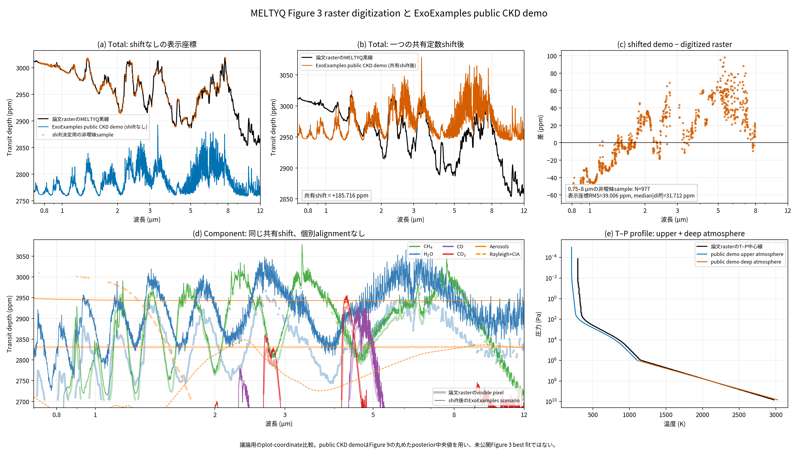

MELTYQ Figure 3 forward comparison と暫定 raster 比較
======================================================

`English translation <../../en/meltyq/meltyq_figure3_forward_preparation_en.html>`__

目的と主張範囲
--------------

`MELTYQ 論文 <https://doi.org/10.3847/1538-4357/ae6917>`__ の Figure 3 と同じ物理要素を通る、K2-18 b の transmission forward comparison を実装した。
中心となる `meltyq_figure3.py <https://github.com/HajimeKawahara/exoexamples/blob/main/examples/meltyq/meltyq_figure3.py>`__ は、Figure 8 で検証した magma--deep-atmosphere 計算を、上層大気、opacity、ExoJAX の transit radiative transfer、公開 JWST data の bin へ接続する。

ただし、repository に含めた :file:`meltyq_figure3_public_demo.json` は、公開 Figure 9 の一次元 posterior 図から読み取った丸めた中央値を用いる demonstration である。
Figure 3 の黒線に使われた未公開 maximum-likelihood vector ではなく、現時点の数値出力を「MELTYQ Figure 3 の再現」とは主張しない。
この public demo の既定 RT は ExoJAX-native ``exojax_simpson`` である。TauREx legacy chord と rectangle integration は、MELTYQ discretization との比較を明示的に要求した場合だけ ``taurex_rectangle`` として使う。
本書の後半では、著者数値dataを受領するまでの議論用として、公開Figure 3 rasterから読み取ったcurveとpublic demoを比較する。この読取値は著者提供spectrumの代用品ではなく、likelihoodや再現精度の主張には使わない。

Opacity 計算前までの public-demo deep smoke では boundary/profile/base が全て収束し、iteration は 4/3/3、:math:`R_{10}=2.336349666\,R_\oplus`、:math:`b_{\rm H_2O}=2.0625\times10^{-2}`、:math:`b_{\rm CH_4}=3.0685\times10^{-4}` であった。
この H2O は論文本文の Figure 4 に記された 0.1--1% より高く、CH4 は低い。
したがって、これはあくまで ``mass_earth=8.63``、ExoPie radius、Figure 9 の visual reading、operational basis mapping を使った「opacity 前の demonstration deep state」であり、best-fit の一致を示す結果ではない。

入力から観測 bin までの一本道
-------------------------------

全入力を

.. math::

   \boldsymbol{\theta}
   = \left(M_p,R_\star,\boldsymbol{\theta}_{\rm magma},
   \boldsymbol{\theta}_{T},\boldsymbol{\theta}_{\rm cloud},
   \boldsymbol{\theta}_{\rm haze},\{\Delta_g\}\right)

と書くと、実装した forward map は次の一式で要約できる。

.. math::

   \boldsymbol{\theta}
   \xrightarrow[\mathrm{ExoEOS/ExoPie}]{\mathrm{ExoGibbs}}
   \left(R_{10},\boldsymbol{b}\right)
   \xrightarrow[\mathrm{opacity}]{T(P),\,x_i(P)=b_i}
   \{\Delta\tau^{(c)}_{\ell q k}\}
   \xrightarrow{\mathrm{ArtTransPure}}
   D^{(c)}_k
   \xrightarrow{\mathrm{bin}+\mathrm{offset}}
   \bar D^{(c)}_j+\Delta_{g(j)} .

ここで :math:`R_{10}` は 10 bar 半径、:math:`\boldsymbol{b}` は 10 bar で quench した 9 種 :math:`(\mathrm{H_2},\mathrm{He},\mathrm{O_2},\mathrm{H_2O},\mathrm{CO},\mathrm{CO_2},\mathrm{CH_4},\mathrm{N_2},\mathrm{NH_3})` の mole fraction、:math:`\ell` は layer、:math:`k` は spectral point、:math:`q` は CKD の :math:`g` ordinate である。
Diffgrid では :math:`q` はない。
:math:`c` は total、aerosols、Rayleigh+CIA、または一分子だけを通す standalone RT scenario を表す。

Magma--gas equilibrium、solubility、非理想 deep atmosphere、10 bar 半径までの式と solver の対応は :doc:`meltyq_figure8_forward_comparison_ja` にまとめた。
このページでは、その出力 :math:`(R_{10},\boldsymbol{b})` から先を詳しく示す。
岩石半径は明示値を設定でき、未設定時だけ外部 package ExoPie を用いる。

Melt input の basis は config で必須である。
``exogibbs_elemental`` は値をそのまま渡し、public demo の ``paper_labelled_operational_mapping`` は

.. math::

   C_{\rm provider}=\frac{28.0101}{12.0107}C_{\rm paper},\qquad
   N_{\rm provider}=\frac{28.0134}{14.0067}N_{\rm paper}

を適用する。
これは既定を暗黙に同一視しないための operational mapping であり、論文の typo や bug を主張するものではない。

上層大気
--------

``ArtTransPure.from_pressure_boundaries`` により、:math:`10^{-10}`--10 bar を 100 layer の log-pressure grid にする。
各 layer の温度は :math:`s=\log_{10}(P/\mathrm{Pa})` に対し、次の anchor を直線補間する。

.. math::

   (s,T)=(-2,T_{10^{-2}\,\mathrm{Pa}}),\ (2,T_{100\,\mathrm{Pa}}),\
   (4,T_{10^4\,\mathrm{Pa}}),\ (6,T_b).

:math:`P<10^{-2}` Pa では :math:`T=T_{10^{-2}\,\mathrm{Pa}}` とする。
これは TauREx ``NPoint`` と同じ log-pressure interpolation であり、その後に config の ``smoothing_window_percent`` を使う centered moving average を適用する。
layer 数を :math:`N`、percent 値を :math:`f` とし、:math:`n_0=\lfloor Nf/100\rfloor` とすると、window 幅 :math:`w` は :math:`n_0` が odd ならそのまま、even なら :math:`n_0+1` とする。
:math:`w>1` のとき :math:`h=(w-1)/2` として interior を

.. math::

   T_i=\frac{1}{w}\sum_{r=-h}^{h}T^{(0)}_{i+r}
   \qquad (h\le i<N-h)

で置き換え、両端 :math:`h` layer は unsmoothed profile :math:`T^{(0)}` のまま残す。
public demo は TauREx default と同じ :math:`f=10` を採り、100 layer なので 11-layer moving average、両端は各 5 layer のままである。
MELTYQ Figure 3 run の exact percent 値は著者確認事項である。

組成は quench assumption により全 layer で

.. math::

   x_i(P)=b_i,\qquad \mu=\sum_i b_i m_i

と固定する。
public baseline の ``radiative_transfer_scheme=exojax_simpson`` は :math:`T(P)`、:math:`\mu`、:math:`R_{10}`、:math:`g_{10}=GM_p/R_{10}^2` を ExoJAX ``ArtTransPure`` に渡し、variable-gravity atmosphere と Simpson annulus integration を使う。
``taurex_rectangle`` は MELTYQ との互換性確認に限って選ぶ明示的 option であり、TauREx と同じ bottom-up Euler recurrence になるよう ``hydrostatic_scheme="layer_constant_gravity"`` を指定する。

Opacity と radiative transfer
-----------------------------

分子線 opacity は H2O、CO、CO2、CH4、NH3 の 5 種である。
概念的な extinction は

.. math::

   \alpha_{\rm mol}=\sum_s n_s\sigma_s(\tilde\nu,P,T),\qquad
   \alpha_{\rm CIA}=n_{\rm H_2}^2\sigma_{\rm H_2-H_2}
   +n_{\rm H_2}n_{\rm He}\sigma_{\rm H_2-He},

.. math::

   \alpha_{\rm Ray}=\sum_i n_i\sigma_{{\rm Ray},i}(\tilde\nu)

である。
public ``exojax_simpson`` path では :math:`w_s=b_s m_s/\mu` を ExoJAX の ``opacity_profile_xs`` または ``opacity_profile_xs_ckd`` に渡す。MELTYQ-compatible ``taurex_rectangle`` path では mole fraction、center number density、geometric layer thickness から cgs の absorber column を作り、ExoJAX の layer-opacity API に渡す。
CIA は H2--H2 と H2--He、Rayleigh scattering は 9 gas 全てを含む。
``taurex_rectangle`` compatibility path では CIA の範囲外規約も `pinした TauREx HitranCIA source <https://github.com/ucl-exoplanets/taurex3/blob/7b6e82a86d4675f140e9e59f3d1410a863251c03/src/taurex/cia/hitrancia.py>`__ に合わせる。
両 RT scheme は一つの明示的な ExoJAX contract、``OpaCIA(cdb, nu_grid=..., wavenumber_interpolation="interp")``、を共有する。
``OpaCIA.logacia_matrix`` は log10 値を返すが、native table の係数 :math:`k_{qj}` 自体は log 空間ではなく線形係数空間で、まず temperature、次に wavenumber の順に補間される：

.. math::

   k_j(T_i)=\operatorname{lerp}_{T}(T_i;T_q,k_{qj}),
   \qquad
   k_{i\lambda}=\operatorname{lerp}_{\tilde\nu}
   (\tilde\nu_\lambda;\tilde\nu_j,k_j(T_i)).

native wavenumber range 外で ``interp`` が返す値は ``numpy.interp`` と同じ端値である。
public ``exojax_simpson`` path は同じ補間結果に native table range 外 zero mask を掛ける。``taurex_rectangle`` compatibility path だけが端値を保持するため coverage mask を全て true とする。

public config の ``rayleigh_provider=taurex`` は `pinした TauREx scattering source <https://github.com/ucl-exoplanets/taurex3/blob/7b6e82a86d4675f140e9e59f3d1410a863251c03/src/taurex/util/scattering.py>`__ を code-faithful に ExoExamples 内へ移植し、TauREx が返す m\ :sup:`2` molecule\ :sup:`-1` を共通 opacity input の cm\ :sup:`2` molecule\ :sup:`-1` へ :math:`10^4` 倍する。この cgs cross section は ExoJAX の absorber-column API にそのまま渡す。
H2 と He には専用式を使う。
:math:`\Lambda=10^8/\tilde\nu` [Angstrom] とすれば、単位変換後の式は

.. math::

   \sigma_{\rm H_2}=8.14\times10^{-13}\Lambda^{-4}
   \left(1+1.572\times10^6\Lambda^{-2}
   +1.981\times10^{12}\Lambda^{-4}\right)\ \mathrm{cm^2},

.. math::

   \sigma_{\rm He}=5.484\times10^{-14}\Lambda^{-4}
   \left(1+2.44\times10^5\Lambda^{-2}\right)\ \mathrm{cm^2}.

他の 7 分子は、TauREx の species-specific refractive index :math:`n_s(\tilde\nu)` と King factor :math:`F_s(\tilde\nu)` を一般式

.. math::

   \lambda=\frac{10^4}{\tilde\nu}\,10^{-6}\ \mathrm{m},\qquad
   A_s=\frac{n_s^2-1}{N_{\rm ref}(n_s^2+2)},\qquad
   \sigma_s[\mathrm{cm^2}]=10^4\frac{24\pi^3F_sA_s^2}{\lambda^4},

.. math::

   N_{\rm ref}=2.6867805\times10^{25}\ \mathrm{m^{-3}}

に入れる。
``rayleigh_provider=exojax`` は provider 差を見るための感度比較であり、public comparison の default ではない。

Lee haze は :math:`a` を particle radius [micron]、:math:`\tilde\nu` を wavenumber [cm\ :sup:`-1`] として

.. math::

   x=\frac{2\pi a\tilde\nu}{10^4},\qquad
   Q_{\rm ext}=\frac{5}{Q_{\rm LEE}x^{-4}+x^{0.2}},\qquad
   \sigma_{\rm ext}=\pi(a\,10^{-6})^2Q_{\rm ext}

を用いる。
:math:`P_{\rm LEE}` を log-pressure 幅 :math:`L` の中心と解釈し、

.. math::

   P_{\rm top}=P_{\rm LEE}10^{-L/2},\qquad
   P_{\rm bottom}=P_{\rm LEE}10^{L/2}

とする。
既定の :math:`L=2` と ``exp_decay`` profile では、layer 内の particle number density は

.. math::

   n_{\rm haze}(P)=X_{\rm LEE}\left(\frac{P}{P_{\rm bottom}}\right)^5

で、範囲外はゼロである。
この pressure bound と :math:`P^5` profile は、現在の公開 TauREx-PyMieScatt sourceに対する code-faithful translation である。
ただし `2025-05-09 の commit 2973ace <https://github.com/groningen-exoatmospheres/taurex-pymiescatt/commit/2973acec3985c2222281062be16a07428c43d621>`__ は、その直前の式

.. math::

   n_{\rm haze}^{\rm previous}(P)=X_{\rm LEE}
   \left\{1-\exp\left[-5\frac{P-P_{\rm top}}
   {P_{\rm bottom}-P_{\rm top}}\right]\right\}

を現行の :math:`P^5` 形へ変更した。
したがって未確定なのは profile の意味だけでなく、MELTYQ Figure 3 実行時の plugin commit と実際の式である。
著者確認前は現在の公開 source を default とし、旧式の compatibility option は追加しない。
vertical layer depth :math:`n_{\rm haze}\sigma_{\rm ext}\Delta z` を作り、選択した transit scheme が slant geometry を処理する。
``constant`` profile も明示的に選べる。

gray cloud は

.. math::

   \Delta\tau_{\rm cloud}(P,\lambda)=
   \begin{cases}
   0, & P<P_{\rm cloud},\\
   \infty, & P\ge P_{\rm cloud}
   \end{cases}

という完全不透明 deck である。
この数式上の :math:`\infty` は component helper ではそのまま保持するが、vectorized chord 行列には構造的な zero があり :math:`0\times\infty` が NaN になる。
そのため RT 境界だけで vertical optical depth を :math:`10^{20}` に置換する。
これは透過率が数値的に完全に zero となる有限表現であり、:file:`metadata.json` に値を記録する。

Transit geometry と annulus integration
----------------------------------------

public config の ``radiative_transfer_scheme=exojax_simpson`` が ExoExamples-native path である。pressure-coordinate opacity、実 shell boundary の chord geometry、annulus integration はそれぞれ ExoJAX の `ArtTransPure source <https://github.com/HajimeKawahara/exojax/blob/develop/src/exojax/rt/trans.py>`__、`chord source <https://github.com/HajimeKawahara/exojax/blob/develop/src/exojax/rt/chord.py>`__、`radiative-transfer source <https://github.com/HajimeKawahara/exojax/blob/develop/src/exojax/rt/rtransfer.py>`__ が所有する。

ExoJAX API の array は top-to-bottom 順である。以下では式を読みやすくするため bottom-to-top の layer index を :math:`i=0,\ldots,N-1` とし、実 radius boundary を :math:`r_i<r_{i+1}`、下・上 pressure boundary を :math:`P_i^{\rm lev}>P_{i+1}^{\rm lev}`、:math:`h_i=r_{i+1}-r_i` と書く。native variable-gravity atmosphere は

.. math::

   g_i=g_{10}\left(\frac{R_{10}}{r_i}\right)^2,
   \qquad H_i=\frac{k_{\rm B}T_i}{\mu_i m_u g_i},

.. math::

   r_{i+1}=\frac{r_i}{1-(H_i/r_i)
   \ln(P_i^{\rm lev}/P_{i+1}^{\rm lev})}

と逐次積分する。分子 :math:`s` の mass fraction :math:`w_s=b_s m_s/\mu` に対し、``opacity_profile_xs`` と ``opacity_profile_xs_ckd`` が評価する pressure-column form は

.. math::

   \delta\tau_{s,i\lambda}
   =\sigma_{s,i\lambda}
   \frac{\Delta P_i\,w_s}{m_s m_u g_{i,\rm c}}

である。CIA は ``opacity_profile_cia``、Rayleigh は同じ cross-section pressure-column API を使う。haze の幾何学的 depth だけは :math:`\alpha_{i\lambda}h_i` を ``layer_optical_depth_from_extinction`` で作る。
:math:`g_{i,\rm c}` は ExoJAX が layer midpoint radius で評価する gravity であり、:math:`\Delta P_i` は cgs の pressure interval である。

piecewise-constant な layer extinction に対し、impact parameter :math:`b` の ray が shell :math:`j` を通る長さは

.. math::

   L_j(b)=2\left[
   \sqrt{\max(r_{j+1}^2-b^2,0)}-
   \sqrt{\max(r_j^2-b^2,0)}\right],

.. math::

   \tau_\lambda(b)=\sum_j
   \frac{L_j(b)}{h_j}\,\delta\tau_{j\lambda}.

ExoJAX は :math:`b=r_i` の lower-boundary chord と :math:`b=r_i+h_i/2` の midpoint chord を解析式で作る。:math:`F_\lambda(b)=2b[1-\exp(-\tau_\lambda(b))]` と置けば、各 layer の annulus は

.. math::

   \int_{r_i}^{r_{i+1}}F_\lambda(b)\,db
   \simeq\frac{h_i}{6}\left[
   F_\lambda(r_i)+4F_\lambda(r_i+h_i/2)+F_\lambda(r_{i+1})
   \right],

.. math::

   R_{\mathrm{eff},\lambda}^2=R_{10}^2+
   \sum_i\int_{r_i}^{r_{i+1}}F_\lambda(b)\,db,
   \qquad
   D_\lambda[\mathrm{ppm}]=10^6
   \frac{R_{\mathrm{eff},\lambda}^2}{R_\star^2}

となる。最上端では :math:`\tau_\lambda(r_N)=0` とする。CKD は各 :math:`g` ordinate でこの計算を行った後に weight 平均する。

MELTYQ compatibility path
^^^^^^^^^^^^^^^^^^^^^^^^^

``radiative_transfer_scheme=taurex_rectangle`` は、MELTYQ が依存した TauREx discretization と比較するためだけの明示的 option であり、author template がこの mode を保持する。比較仕様は `pinした TauREx planet source <https://github.com/ucl-exoplanets/taurex3/blob/7b6e82a86d4675f140e9e59f3d1410a863251c03/src/taurex/data/planet.py>`__、`simple-model source <https://github.com/ucl-exoplanets/taurex3/blob/7b6e82a86d4675f140e9e59f3d1410a863251c03/src/taurex/model/simplemodel.py>`__、`TransmissionModel source <https://github.com/ucl-exoplanets/taurex3/blob/7b6e82a86d4675f140e9e59f3d1410a863251c03/src/taurex/model/transmission.py>`__ である。この TauREx 3.2.0 source pin は translation の固定点であり、未公開 MELTYQ run の runtime revision を断定するものではない。

hydrostatic recurrence は ExoJAX ``exojax.atm.atmprof`` の ``hydrostatic_radius_profile_ideal_gas`` と ``hydrostatic_scheme="layer_constant_gravity"``、center number density は ``exojax.atm.idealgas.number_density``、vertical depth は ``layer_optical_depth_from_cross_section``、``layer_optical_depth_from_log_cia``、``layer_optical_depth_from_extinction`` が担当する。base gravity だけは TauREx/Astropy と同じ :math:`G=6.67430\times10^{-8}\ {\rm cm^3\,g^{-1}\,s^{-2}}` を使う。native path は ExoJAX constant を使う。

bottom-to-top の altitude を :math:`z_0=0` とすれば、この compatibility recurrence は

.. math::

   g_i=g_{10}\left(\frac{R_{10}}{R_{10}+z_i}\right)^2,
   \qquad H_i=\frac{k_{\rm B}T_i}{\mu_i m_u g_i},

.. math::

   \Delta z_i=H_i\ln\frac{P_i^{\rm lev}}{P_{i+1}^{\rm lev}},
   \qquad z_{i+1}=z_i+\Delta z_i.

center number density :math:`n_i=P_i/(k_{\rm B}T_i)` から

.. math::

   N_{s,i}=b_s n_i\Delta z_i,
   \qquad C_{ab,i}=(b_a n_i)(b_b n_i)\Delta z_i,

.. math::

   \delta\tau_{{\rm mol},i\lambda}
   =\sum_s\sigma_{s,i\lambda}N_{s,i},
   \qquad
   \delta\tau_{{\rm CIA},i\lambda}
   =\sum_{ab}k_{ab,i\lambda}C_{ab,i}

を作る。:math:`\sigma` は cm\ :sup:`2`、:math:`k` は cm\ :sup:`5` であり、同種 CIA pair に追加の :math:`1/2` は掛けない。

TauREx自身が ``compute_path_length_old`` と呼ぶ ``new_path_method=False`` path の tangent radius と仮想 shell boundary は

.. math::

   b_i=R_{10}+\frac{\Delta z_0}{2}+z_i,
   \qquad
   u_j=R_{10}+\frac{\Delta z_0}{2}+z_j+\frac{\Delta z_j}{2},

.. math::

   L_{ij}=\begin{cases}
   0, & j<i,\\
   2\sqrt{u_i^2-b_i^2}, & j=i,\\
   2\left[\sqrt{u_j^2-b_i^2}-\sqrt{u_{j-1}^2-b_i^2}\right], & j>i,
   \end{cases}

.. math::

   \tau_{i\lambda}=\sum_{j=i}^{N-1}
   \frac{L_{ij}}{\Delta z_j}\,\delta\tau_{j\lambda}.

最後は rectangle sum

.. math::

   R_{\mathrm{eff},\lambda}^2=R_{10}^2+
   \sum_{i=0}^{N-1}2(R_{10}+z_i)
   \left(1-e^{-\tau_{i\lambda}}\right)\Delta z_i

を使う。現行TauRExには actual boundary と各 layer midpoint を使う opt-in ``new_path_method=True`` もあるが、最終 annulus sum は同じ rectangle のままであり、既定値も ``False`` である。したがってここでの ``taurex_rectangle`` は「TauRExが廃止した方式」ではなく、MELTYQ-compatible legacy/default path を意味する。ExoExamples にこの比較固有 path を残す一方、public example の主結果には使わない。

二つの molecular-opacity path
------------------------------

``ckd``
   実行しやすい ExoMolOP :math:`R\simeq1000` fast path である。
   H2O/POKAZATEL、CO/Li2015、CO2/UCL-4000、CH4/YT34to10 を用いる。
   ExoMolOP に paper の NH3/BYTe table がないため、この path だけ NH3/CoYuTe へ明示的に置換する。
   同じ :math:`g` ordinate の :math:`k` を足す perfect-correlation approximation であり、MELTYQ の :math:`R=50000` cross-section 計算ではない。

``diffgrid``
   Figure 3 の主比較用に用意した paper-line-list-aligned path である。opacity generation の全条件が論文実装と一致することまでは意味しない。
   H2O/POKAZATEL、CO/Li2015、CO2/UCL-4000、CH4/YT34to10、NH3/BYTe の :math:`R\ge50000` cross section を、同じ wavenumber と 100-layer pressure grid の ExoJAX ``OpaDiffgrid`` archive として読む。
   isotopologue はそれぞれ ``1H2-16O``、``12C-16O``、``12C-16O2``、``12C-1H4``、``14N-1H3`` に固定する。
   archive は repository に同梱せず、manifest descriptor の molecule、exact isotopologue、line list、``teacher_method``、source-grid minimum resolving power を検証する。
   builder は line-database directory 内の全 source/cache file の size と SHA-256 を sidecar に列挙し、その canonical inventory SHA-256 も descriptor と照合する。
   さらに NPZ と companion ``_metadata.json`` sidecar を別々の SHA-256 で検証し、archive 内 ``user_meta`` の schema、molecule、isotopologue、line list、source-grid resolution が descriptor と一致することを確認する。
   5 種で wavenumber grid が同一であることに加え、loaded grid から :math:`R_i=\tilde\nu_i/(\tilde\nu_{i+1}-\tilde\nu_i)` を実測し、宣言した minimum :math:`R=50000` と整合することも確認する。
   したがって、manifest を埋める前の template は実行可能 data ではない。

`meltyq_figure3_build_diffgrid.py <https://github.com/HajimeKawahara/exoexamples/blob/main/examples/meltyq/meltyq_figure3_build_diffgrid.py>`__ はこの archive、sidecar、manifest を構築する entry point である。
一つの process では一分子だけを作り、complete ExoMol ``.trans`` database、PreMODIT teacher、Diffgrid table を解放してから次の species を別 process で開始する。
opacity source の取得には明示的な ``--allow-download`` が必要である。

default generation contract は次の通りである。

* 0.65--12 micron の ESLOG grid を実測 minimum :math:`R\ge50000` にする。default は 145,788 spectral point、:math:`R_{\min}\simeq50000.36` である。
* :math:`10^{-10}`--10 bar の 100 pressure layer を upper forward と共有する。
* 200--1200 K を 21 inverse-temperature node、すなわち :math:`q=0,\ldots,20` に対し :math:`T_q^{-1}=1200^{-1}+(q/20)(200^{-1}-1200^{-1})` とする。
* H2 を requested pressure broadener とし、line-strength cutoff は ``crit=0``、super-line continuum への fallback は行わない。

ESLOG 点数の決定には ExoJAX ``nx_even_from_resolution_eslog(..., definition="pointwise")``、生成した coordinate の実測には ``resolution_eslog(..., definition="pointwise")`` を使う。
したがって :math:`N-1` interval、inclusive endpoint、偶数点への丸め、および pointwise resolving-power の定義は ExoJAX が担い、0.65--12 micron と :math:`R\ge50000` の選択、``nstitch`` divisibility、manifest gate は ExoExamples の比較 policy として残る。

requested ``H2.broad`` file がなければ strict default は build を停止する。
特に public CO/Li2015 source には H2 broadening file がなく、RADIS は未検査のままだと ``.def`` の既定値 :math:`\alpha_{\rm ref}=0.07\ {\rm cm^{-1}\,bar^{-1}}`、temperature exponent :math:`n=0.5` を黙って使う。
``--allow-default-broadening-fallback`` を明示したときだけこの近似を許し、requested file の有無、effective source、parameter range、default 値を archive と manifest に保存する。
missing-file policy は 5 species 共通の build contract なので、一つの manifest を作る全 process で同じ flag を使う。
これは MELTYQ と一致するという主張ではなく、著者確認までの明示された public-data approximation である。

default ``nstitch=1`` では ``OpaPremodit.cutwing`` は no-op であり、物理的な wing cutoff と解釈しない。
``nstitch>1`` で stitch-edge wing truncation を使う場合は spectral point 数が ``nstitch`` で割り切れることを download 前に検証し、effective setting を provenance に記録する。

archive を保存する前に、builder は 21 inverse-temperature node が作る全 20 interval の midpoint で、100 層それぞれを同温度にした isothermal profile を作る。
PreMODIT teacher と Diffgrid の全 cross section が finite であることを要求し、cross-section floor 適用後の

.. math::

   \epsilon=\left|\ln \sigma_{\rm Diffgrid}-\ln \sigma_{\rm teacher}\right|

について、20 profile のそれぞれで既定 :math:`p_{99}(\epsilon)\le0.05` かつ :math:`\max(\epsilon)\le0.5` を満たさなければ save 前に停止する。
閾値は ``--maximum-p99-log-cross-section-error`` と ``--maximum-log-cross-section-error`` で明示的に変更でき、測定値と gate は archive provenance に保存する。
loader は全 20 測定の個数、各 inverse-temperature midpoint、finite な :math:`p_{99}` と maximum、ならびに両閾値を再検証し、``status=passed`` だけの自己申告は受理しない。
midpoint temperature は ExoJAX ``diffgrid_interval_midpoint_temperatures``、teacher との error summary は ``compare_diffgrid_with_teacher`` が計算する。
ExoJAX は数値診断だけを返し、閾値、build 停止、provenance 保存と load 時の再検証は ExoExamples が担う。
これは temperature interpolation に対する opacity-level の numerical gate である。
観測 bin での spectrum、instrument convolution、または transit depth の収束を保証する test ではない。

value table と temperature-derivative table だけで一分子あたり約 4.562 GiB、5 分子で約 22.8 GiB である。
これは ExoMol transition database、PreMODIT teacher、JAX/XLA temporary、archive compression workspace を含まない下限である。
line count も支配的で、特に CH4/YT34to10 は約 340 億 transition を宣言するため、通常の workstation で full build が可能とは仮定しない。

YT34to10 と BYTe の transition file は 12,000 cm\ :sup:`-1`、すなわち 0.833 micron までである。
model grid は 0.65 micron まで存在しても、0.65--0.833 micron に catalogued CH4/NH3 line があることを意味しない。
特に BYTe は旧 NH3 line list で completeness limitation があり、paper の line-list choice に合わせることと、最新かつ完全な NH3 opacity であることは同義ではない。

builder-generated manifest は species 間の exact spectral、pressure、inverse-temperature grid、teacher 設定、package version、ExoJAX Python-source inventory/Git revision を common build contract として保存する。
次の高コスト species build を始める前に、各 coordinate array の canonical float64 SHA-256 と software を含む全設定を既存 manifest に照合し、不一致なら database を読む前に停止する。
完成した archive 群はさらに ``--check-inputs`` と forward loader が事後検証する。
実行前に ``--dry-run``、``--help`` と利用可能資源を確認する。

公開 JWST data、binning、offset
----------------------------------------

観測値は repository へコピーせず、`NIRISS OSF project <https://osf.io/36djh/>`__、`NIRSpec OSF project <https://osf.io/hpu8g/>`__、`MIRI OSF project <https://osf.io/gmhw3/>`__ の revision 1 asset を明示的に download する。
既定では NIRISS/SOSS low-resolution、Hu et al. shifted-average NIRSpec G235H/NRS1、G235H/NRS2、G395H/NRS1、G395H/NRS2、MIRI/LRS JExoRES を読む。
manifest に固定した asset SHA-256 は次の通りで、NIRSpec zip 内の 4 member も個別 hash で検証する。

.. list-table:: Public-asset manifest
   :header-rows: 1
   :widths: 25 75

   * - asset key
     - SHA-256
   * - ``niriss_soss_lowres``
     - ``b4499b16456d19e2b09c35f910a60fbf96d8c14a006fe9f532f17edca051458b``
   * - ``niriss_soss_native``
     - ``779a3511a1f72496429989cf228e6a034d97a80ae506863e3b32a8c6915d64a1``
   * - ``nirspec_hu2025_archive``
     - ``4ee5cb6ad42015bd8fb10f64e54329d250137ab1fa129c89a14830946adc8f18``
   * - ``miri_lrs_jexores``
     - ``fcace11f382706fd474cd27f45b881bfbcf0e4d3042459d1225f846a873b1df1``
   * - ``miri_lrs_jexopipe``
     - ``42db622a0d742e783c632190b0f01baba62be9da1237bb74f453768073d66a87``

cache が存在しても hash 不一致なら上書きせず停止し、network access は ``--fetch-public-data`` を指定したときだけ行う。

binning policy は opacity mode に応じて異なる。
native band edge と観測 bin edge は ExoExamples が与え、再利用可能な sparse numerical operator の構築と spectral axis への適用は ExoJAX が担う。
CKD の値 :math:`D_b` は band center の sample ではなく、native wavenumber band edge で囲まれた有限 band の mean である。
edge を wavelength の :math:`[\lambda_{b,l},\lambda_{b,u}]` に変換し、観測 bin との overlap 幅だけを使って

.. math::

   \bar D_j=\sum_b
   \frac{\left|[\lambda_{b,l},\lambda_{b,u}]
   \cap[\lambda_{j,l},\lambda_{j,u}]\right|}
   {\lambda_{j,u}-\lambda_{j,l}}D_b

と積分する。
観測 bin 全体が native band で覆われなければ停止し、band-center interpolation は行わない。
この finite-band overlap operator は ExoJAX ``band_mean_bin_operator`` で構築する。

Diffgrid だけは point sample 間を piecewise-linear とみなし、ExoJAX ``piecewise_linear_bin_operator`` で再利用可能な sparse operator を構築して、公開 file にある実際の bin edge 上で

.. math::

   \bar D_j=\frac{1}{\lambda_{j,u}-\lambda_{j,l}}
   \int_{\lambda_{j,l}}^{\lambda_{j,u}}D(\lambda)\,d\lambda
   =\sum_k W_{jk}D_k

を厳密に積分する。
両 operator は、全 scenario と全観測 dataset の bin をまとめた一回の ``apply_bin_operator`` で適用する。
どちらも instrument LSF や wavelength-dependent throughput の convolution ではない。

offset は観測値を変更せず、model 側へ :math:`D_{j,\rm model}+\Delta_g` [ppm] として加える。
固定値による run では各 group の任意の author 値をそのまま使い、anchor を要求しない。
public demo だけは NIRISS group を 0 ppm に anchor する convention を採る。
``--profile-offsets`` では optional anchor group を config 値に固定し、それ以外の group ごとに

.. math::

   \widehat\Delta_g=
   \frac{\sum_{j\in g}(D_{j,\rm obs}-D_{j,\rm model})/\sigma_j^2}
        {\sum_{j\in g}1/\sigma_j^2}

を解析的に求める。anchor を ``null`` にすれば全 group を profile する。
これは retrieval ではなく、diagonal Gaussian residual の nuisance profile である。

Component curve と出力
----------------------

Figure 3 の表示に合わせ、component は同じ :math:`T(P)`、組成、gravity、10 bar radius を使いながら、指定した opacity だけを入れる standalone RT と定義する。
RT operator を :math:`\mathcal R` と書けば、8 scenario は

.. math::

   D_{\rm total}=\mathcal R\!\left[\Delta\tau_{\rm haze}+\Delta\tau_{\rm cloud}
   +\Delta\tau_{\rm Ray}+\Delta\tau_{\rm CIA}+\sum_s\Delta\tau_s\right],

.. math::

   D_{\rm aerosols}=\mathcal R[\Delta\tau_{\rm haze}+\Delta\tau_{\rm cloud}],
   \qquad
   D_{\rm rayleigh+cia}=\mathcal R[\Delta\tau_{\rm Ray}+\Delta\tau_{\rm CIA}],

.. math::

   D_{{\rm molecule},s}=\mathcal R[\Delta\tau_s],
   \qquad s\in\{\mathrm{H_2O,CO,CO_2,CH_4,NH_3}\}

である。
したがって ``molecule_H2O`` に aerosol、Rayleigh、CIA、他分子は含まれない。
:math:`\mathcal R` は非線形なので standalone curve の和は total と一致する必要がない。

Diffgrid の value/derivative table 約 22.8 GiB を RT kernel の closure に置くと、XLA executable の巨大な定数になり得る。
そこで temperature-dependent molecular cross section は RT JIT の外で一度だけ補間する。
table は ExoJAX interpolation JIT の dynamic argument であり、同じ shape の 5 species は同じ compiled interpolation を再利用する。
RT kernel には補間済み layer cross section（5 species 合計約 0.54 GiB）だけを dynamic argument として渡す。
そのうえで 8 scenario を stack して一回の ``jax.vmap`` を JIT compile するため、巨大 table の RT executable への埋め込みと component ごとの不要な再 compile の両方を避ける。
CSV は NH3 を含む全 5 molecular scenario を保存するが、Figure 3-style plot は paper の表示に合わせて H2O、CO、CO2、CH4 の 4 molecular curve、aerosols、Rayleigh+CIA と total を描き、NH3 standalone curve は描かない。
出力 directory には :file:`model_spectra.csv`、:file:`binned_comparison.csv`、:file:`figure3_forward_comparison.png`、:file:`metadata.json` を保存する。
plot の黒線と component 線は dataset offset 適用前の intrinsic spectrum であり、各観測 dataset と同色の短い model 線が bin 積分と group offset 適用後の比較値である。
metadata は package version、deep-solver convergence、opacity provenance と interpolation bounds、data provenance、offset、residual、opacity preparation と RT compile を分離した timing を記録する。
full run では CKD H5、CIA file、optional reference CSV の SHA-256 も記録する。
``memory_estimate`` は spectral point 数と :math:`g` 点数に加え、Diffgrid archive table の総量、one-species streaming 時の peak resident table、保持する補間済み molecular cross section、主要 float64 RT work array を記録する。stage peak の下限は ``max(one table + retained cross sections, retained cross sections + RT work arrays)`` とする。CIA/Rayleigh array、XLA temporary、backend allocator overhead は含まない。

公開 raster からの暫定比較
---------------------------

著者のmachine-readable spectrumを受領するまでの議論用に、`arXiv:2605.08752 <https://arxiv.org/abs/2605.08752>`__ のsource bundleに含まれる原寸Figure 3 PNG ``f3_Combined_k2-18b.png`` を読み取った。
sourceは3597 x 1494 pixel、SHA-256は ``3ca19cbe480878a8bf67d022cbe2eb6f0caa14733187c6b929a057886575ebe7`` である。
論文とsource artworkは `Creative Commons Attribution 4.0 <https://creativecommons.org/licenses/by/4.0/>`__ で公開されている。

Figure 8の各panelと異なり、このFigure 3 source自体がrasterであり、内部にvector pathや数値tableはない。
したがって、ここで「OCR」と呼んでいる操作を厳密に分けると、tick labelの認識と、pixel color/連続性によるcurve digitizationである。
原画像のpixel centerを :math:`(x,y)` とし、印刷されたtickからleast-squaresで

.. math::

   \log_{10}\!\left(\frac{\lambda}{\mu\mathrm{m}}\right)
   =4.9043699204\times10^{-4}x-0.284569423,

.. math::

   D_{\rm ppm}=3335.438596-0.701754386y,

.. math::

   T[\mathrm{K}]=8.547008547x-25897.435897,
   \qquad
   \log_{10}\!\left(\frac{P}{\mathrm{Pa}}\right)
   =0.0163742690y-4.826900585

と校正した。
横1 pixelはおよそ :math:`R=885`、spectrum縦1 pixelは0.702 ppm、temperature横1 pixelは8.55 K、pressure縦1 pixelは0.0164 dexに相当する。

黒solid MELTYQ curveは、隣接column間のvertical stepへpenaltyを課したglobal continuity traceを3種類のpenaltyで実行し、local dark strokeの中央値へcenterした。
3 trace間のspreadと、そのcolumnで黒い観測error barが重なる可能性を各行に保存した。
色が一意なCH4、H2O、CO、CO2、aerosols、Rayleigh+CIAはexact RGB pixelの中央値、T--P黒線は各raster rowのdark-pixel中央値で読み取った。
:download:`digitized CSV <../../meltyq/data/meltyq_figure3_raster_reference.csv>` は合計10245 sampleで、全行のcontractを ``published_raster_plot_digitization`` とする。
黒線2579 columnのうち246 columnはalgorithm間spreadが2 pixelを超え、1245 columnはerror bar overlap候補である。
curveが非表示、plot下限外、または破線のgapにあるcomponent波長はCSVに現れないため、欠損をzero opacityとは解釈しない。

比較している二つの計算条件は同一ではない。

.. list-table:: 暫定比較の条件
   :header-rows: 1
   :widths: 24 38 38

   * - 項目
     - 公開Figure 3 raster
     - 現ExoExamples public demo
   * - parameter point
     - 未公開maximum-likelihood vector
     - Figure 9の一次元posteriorから読んだ丸めた中央値
   * - molecular opacity
     - 論文記載の :math:`R=50000` ExoMol cross section
     - :math:`R\simeq1000` ExoMolOP CKDとmatching-:math:`g` perfect correlation
   * - radiative transfer
     - TauREx
     - ExoJAX ``ArtTransPure(integration="simpson")``
   * - dataset offset
     - datasetごとにretrievalした値、raster曲線への適用方法は未確認
     - config値は全group 0 ppm

従ってrawなabsolute transit depth差には、少なくとも10-bar radius、stellar radius、dataset offset convention、parameter pointの差が同時に入る。
これをfitせずshapeだけ眺める補助表示として、0.75--8 micronの黒線からalgorithm-ambiguous columnとerror-bar-overlap候補を除いた977 sampleを集合 :math:`S` とし、ExoExamplesの全scenarioへ一つだけ共通に加える定数

.. math::

   \Delta_0=-\operatorname{median}_{i\in S}
   \left[D_{\rm ExoExamples}(\lambda_i)-D_{\rm raster}(\lambda_i)\right]
   =+185.716\ \mathrm{ppm}

を定義した。
これはretrieved offsetでもradius補正でもなく、plot上のvertical alignmentにすぎない。
alignment前の ``ExoExamples - raster`` はmedian -185.716 ppm、RMS 189.461 ppmである。
alignment後の

.. math::

   r_i=D_{\rm ExoExamples}(\lambda_i)+\Delta_0-D_{\rm raster}(\lambda_i)

はRMS 39.006 ppm、median absolute 31.712 ppm、maximum absolute 97.890 ppmとなった。
この数値は異なるparameter pointとopacity modeを比較したraster-scale diagnosticであり、likelihood、model error、またはMELTYQ再現誤差ではない。

上図ではraw total、同じ :math:`\Delta_0` だけを加えたtotalとresidual、6 component、およびT--Pを分離している。
totalの大域的なCH4/H2O band構造は同じ波長域に現れるが、alignment後も0.75--1 micronでExoExamplesが平均約52 ppm低く、4--5 micronで約47 ppm、5--8 micronで約42 ppm高い。
従って差は定数baselineだけではなく、broad continuum slopeとfeature amplitudeにも残る。
componentはpaper側でvisibleなpixelだけの比較であり、全componentへ同一 :math:`\Delta_0` を使う。curveごとの再alignmentはしていない。

Lee profile の version 感度は可視域の差に対して大きい。ここでの数値は著者確認前の one-off sensitivity audit であり、旧式を public interface に追加したものではない。他の全入力を固定し、上の直前 revision の式だけに置き換え、同じ 977 sample を使い、各variantごとに一つの median 共有 shift を求めた。そのとき黒線との display-coordinate RMS は 39.01 ppm から 16.42 ppm へ、0.75--1.6 micron では 41.59 ppm から 6.34 ppm へ低下した。
一方、旧式は cloud+Lee scenario に論文 raster の orange-solid Aerosols curve にはない強い傾きを生じる。
これは旧式が論文で使われた証拠ではない。plugin commit、Lee 式、Aerosols に Lee を含めたか、total/component を同一 run から生成したかは著者確認待ちである。

T--P比較ではpublic-demo upper profileが公開rasterより主に低温である。
:math:`10^{-4}\le P\le10^6` Paのvisible raster sampleに対する ``ExoExamples - raster`` はmedian -79.6 K、RMS 72.8 Kである。
:math:`10^6\le P\le P_{\rm melt}` のdeep linear-log-pressure branchはmedian -4.4 K、RMS 31.3 Kまで近い。
この違いはpublic configがFigure 9の丸めた1-D中央値を組み合わせた点であり、joint maximum-likelihood T--P curveでないことと整合する。

生成したpublic CKD demoそのものは :math:`R_{10}=2.336350R_\oplus` を返し、公開934 binとのzero-offset、diagonal-only residualはRMS 177.512 ppm、parameter-count補正なし :math:`\chi^2/N=9.949` であった。
これはbest fitとして不十分であることを数値で確認するが、著者runとの優劣を意味しない。
現在分離できない主要因は、maximum-likelihood vector、exact bulk/radius条件、retrieved offset、R50k opacity provenance、H2/He broadening、TauREx discretization、およびhaze/cloud profileである。

再現用のpixel extractorは :file:`docs/meltyq/extract_meltyq_figure3_reference.py`、比較figure builderは :file:`docs/meltyq/build_meltyq_figure3_raster_comparison.py` である。
:download:`comparison summary <../../meltyq/data/meltyq_figure3_raster_comparison_summary.json>` は使用sample、hash、shift、residual、component、T--Pの数値を保存する。
著者から数値curveを受領した後は、このraster contractをauthor contractへ昇格させず、下記の ``intrinsic_unoffset_model`` CSVとfilled Diffgrid runで置き換える。

実行と確認
----------

初回の public CKD demo は repository root から実行する。以下の無指定 command は checked-in public config を読み、ExoJAX Simpson を使う。

``--check-inputs`` は forward solve をせず、巨大な cross-section tensor を展開しない lightweight audit である。
public data は path と pinned SHA-256 を検証し、CIA file は存在、実ファイルの SHA-256、および HITRAN header の pair identity を照合して H2-H2/H2-He の取り違えを拒否する。CKD H5 はさらに期待する ExoMolOP basename、存在する場合の ``mol_name``、および分子量を species ごとに照合し、別分子 table の取り違えを拒否する。
Diffgrid は 5 NPZ と sidecar の file 全体を SHA-256 に通し、descriptor、metadata、``user_meta`` を照合するほか、small ``nu_grid``/``pressure_grid``/``temperature_grid`` arrays だけを読んで common build contract、teacher、実測 resolving power を検証する。
巨大な ``log_cross_section_grid`` と derivative tensor は load しないので、full forward run の memory 見積もりとは分けて考えられる。
この lightweight path と full Diffgrid loader はどちらも、config の 0.65--12 micron 両 endpoint を wavenumber grid が cover することを deep solve 前に要求する。

.. code-block:: console

   python examples/meltyq/meltyq_figure3.py --check-inputs

.. code-block:: console

   python examples/meltyq/meltyq_figure3.py --fetch-public-data --allow-opacity-download --benchmark-repeats 3

二回目以降は download flag を外す。

.. code-block:: console

   python examples/meltyq/meltyq_figure3.py --benchmark-repeats 3

著者値を入力済みの author config でMELTYQのTauREx discretizationと比較する場合だけ、legacy configを明示する。

.. code-block:: console

   python examples/meltyq/meltyq_figure3.py --config PATH_TO_FILLED_AUTHOR_CONFIG.json

filled Diffgrid manifest を使う主比較は次の形である。

.. code-block:: console

   python examples/meltyq/meltyq_figure3.py --opacity-mode diffgrid --diffgrid-manifest PATH_TO_FILLED_MANIFEST.json

Diffgrid builder の option と明示 download 手順は次で確認する。

.. code-block:: console

   python examples/meltyq/meltyq_figure3_build_diffgrid.py --help

CO/Li2015 の public-data approximation を採用する場合の一例は次である。同じ manifest の他 4 species にも同じ fallback flag を付ける。

.. code-block:: console

   python examples/meltyq/meltyq_figure3_build_diffgrid.py --species CO --allow-download --allow-default-broadening-fallback

network や大きな opacity data を使わない単体確認は次で行う。

.. code-block:: console

   JAX_PLATFORMS=cpu python -m pytest -q tests

この test は式、units、hash rejection、bin 積分、offset、全 component を一つの kernel shape で返すことを確認するが、full deep solve や実 data download の成功までは保証しない。

著者依存 input と再現性 artifact
--------------------------------------------------

著者依頼部分は forward code と分離する。

* :file:`examples/meltyq/configs/meltyq_figure3_author.template.json`: copy した上で Figure 3 黒線の exact maximum-likelihood vector、fixed bulk values、temperature smoothing percent、melt basis、data reduction、offset の値・group・符号を入れる。paper-compatibility contract として ``radiative_transfer_scheme=taurex_rectangle`` を明示しており、``null`` を含む template 自体は実行できない。
* :file:`examples/meltyq/configs/meltyq_figure3_reference_spectrum.template.csv`: ``spectrum_contract,wavelength_micron,transit_depth_ppm`` の三列で、``spectrum_contract`` は全行 ``intrinsic_unoffset_model`` とする。すなわち dataset offset 適用前の著者の黒線を wavelength 昇順に入れ、offset は config 側だけに置く。``--check-inputs`` は contract、header、finite 値、strict な wavelength 昇順を監査し、``--reference-spectrum-sha256 64_HEX_DIGITS`` を併用すれば file SHA-256 も固定する。
* opacity について著者に求めるのは manifest file そのものではなく、pressure broadening、wing cutoff、isotope abundance、temperature/pressure/wavenumber grid、teacher method など exact generation settings と provenance である。

:file:`examples/meltyq/configs/meltyq_figure3_diffgrid_manifest.template.json` は著者依存 artifact ではない。
public opacity source と明示した generation settings から ExoExamples builder が作る local reproducibility record であり、NPZ/sidecar の hash と archive 内 provenance を固定する。

reference curve を得た後は Diffgrid run に ``--reference-spectrum PATH_TO_REFERENCE.csv`` を追加し、可能なら ``--reference-spectrum-sha256 EXPECTED_SHA256`` で取得した artifact を pin する。
model point sample を reference wavelength へ線形補間し、overlap 内の RMS、median absolute、maximum absolute residual [ppm] を :file:`metadata.json` に保存する。CKD native 値は有限 band mean なので、この point-wise reference 比較には使用せず明示的に停止する。

まだ確定していないもの
------------------------

* Figure 3 の maximum-likelihood vector、posterior samples、全 prior と固定値。
* exact stellar/planetary bulk values、rocky-radius relation、10 bar radius convention。
* paper label の C/N melt basis と ExoGibbs provider basis の最終対応。
* 高圧 N solubility の式形。現 ExoGibbs は一次文献の :math:`\sqrt{P}` 形を使うが、MELTYQ Appendix の組版式は linear-:math:`P` 形である。
* exact data revision/reduction、offset grouping・sign・units、channel covariance。
* instrument LSF、throughput、paper が用いた exact binning procedure。
* MELTYQ Figure 3 が使った ``smoothing_window_percent`` の exact 値。
* MELTYQ Figure 3 実行時の TauREx-PyMieScatt commit、Lee 鉛直分布式、orange Aerosols curve に Lee を含めたか、および total/component が同一 run に由来するか。
* R50k table の pressure broadening、line-wing cutoff、isotopic abundance、teacher と grid construction provenance。現 builder は H2 を要求し、file がない場合は strict に停止する。明示 fallback 時だけ ``.def`` defaults を記録して使う。
* MELTYQ opacity が H2/He mixed broadening を使ったかどうか。
* Figure 3 黒線の machine-readable spectrum。

これらは比較の claim level を決める input/provenance であり、現時点で ExoFamily package の API 不足を示すものではない。

ExoFamily 側の修正
------------------

今回必要だった upper-atmosphere、exact spectral-binning、Diffgrid diagnostics、および pointwise ESLOG grid-sizing API は ExoJAX に移植済みであり、現実装に追加の ExoFamily 側修正は不要である。
ExoExamples-native path は ExoJAX ``ArtTransPure(integration="simpson")`` を使う。
ExoGibbs の public magma/deep solver、ExoEOS の density provider、ExoJAX の ``OpaCKD``、``OpaDiffgrid``、``OpaCIA``、ideal-gas geometry、layer-opacity、Rayleigh、``ArtTransPure``、spectral-binning operators、Diffgrid diagnostics、ESLOG resolution utilities で forward chain と opacity preparation を構成できた。
TauREx 固有の Rayleigh 式、legacy chord/rectangle quadrature、Lee haze、gray cloud、OSF data contract、観測 bin の選択、offset、reference comparison は比較または example 固有の policy として ExoExamples に残す。
piecewise-linear sample と finite-band mean の数値積分は ExoJAX が担う。
著者確認で H2/He mixed broadening が必須と分かった場合は、exact mixture を表現する ExoJAX multi-broadener path、または外部 teacher で Diffgrid を再生成する必要がある。
これは条件付きの fidelity requirement であり、現時点の ExoFamily API defect ではない。
著者 artifact を入れた後に、たとえば高圧 N solubility variant を provider option として公開する必要が確定した場合だけ、再現可能な最小 case とともに ExoGibbs 側の変更として別途報告する。
