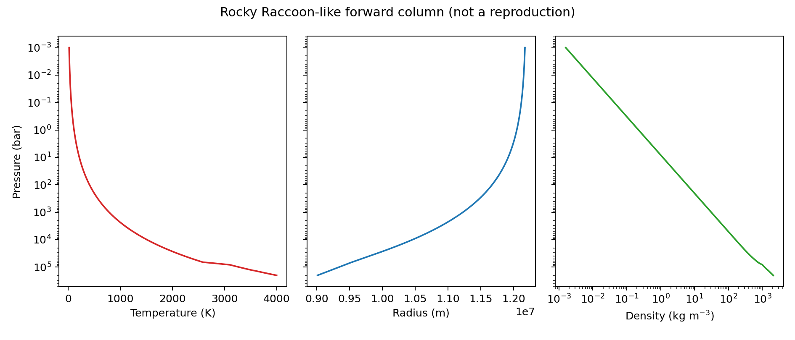
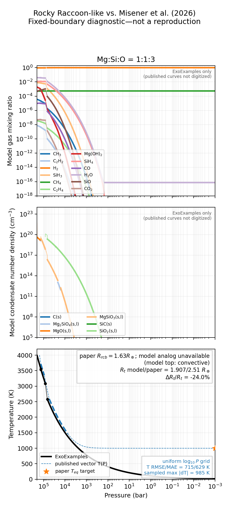

Rocky Raccoon-like deep-envelope column
========================================

**Document status:** この日本語版をmasterとする。
`English edition <../../en/rocky_raccoon/raccoon_like_forward_en.html>`__ も
同じtechnical contractと検証結果を記載する。

目的と主張範囲
--------------

このexampleは、`Misener et al. (2026)
<https://arxiv.org/abs/2608.24873>`__ に着想を得たRocky Raccoon-likeな
chemistry--structure計算のうち、ExoExamplesが担う部分を実装する。
これはExoGibbsとExoEOSのintegration benchmarkであり、論文の再現ではない。
したがってmachine-readable outputには
``raccoon_like_not_paper_reproduction`` というclaimを記録する。

現在のmilestoneは、magma interfaceからdeep atmosphereまでのworkflowに意図的に
限定している。authoritativeなCUDA default-grid runでは、採択した全1,903 layerで
equilibriumが収束した。これは一つのpressure gridにおけるfixed-boundary実装の
検証であり、pressure-grid convergenceの結果ではない。このexampleでは、論文で
不足しているinputを調整して公表radiusに合わせることはしない。

package間の責務
---------------

.. list-table:: 現在の責務分担
   :header-rows: 1
   :widths: 20 38 42

   * - Package
     - このexampleでの役割
     - そのpackageが担わないもの
   * - ExoExamples
     - 論文由来のspecies policy、二つのcandidateを扱うbranch transaction、
       pressure/radius stepping、constant transport closure、CLI、output
     - 再利用可能なequilibriumまたはequation-of-state algorithm
   * - ExoGibbs
     - gas--condensate equilibrium、phase support、conservation audit、
       rainout composition propagation
     - structure branch selection
   * - ExoEOS
     - ideal-mixture density、heat capacity、adiabatic gradient
     - 論文固有のspecies selectionまたはtransport
   * - ExoJAX
     - 現milestoneでは未使用
     - 将来の厳密なupper-boundary stitchとradiative transferは保留

``ExoStructure`` packageは導入しない。実際に共有すべきstructure physicsが現れるまで、
couplerはExoExamples内に置く。

厳密なchemistry契約
-------------------

5-element configurationでは、論文Appendix Aに列挙された70 gas speciesをそのまま
minimizeする。canonical presetには14 condensateがあり、``oxygen_poor_sio``
sensitivityでは15番目として ``SiO(s)`` を加える。elementだけによるfilterは、
FastChem catalogから余分なspeciesを暗黙に取り込むため使用しない。

formula matrixのrowは ``H``、``Mg``、``Si``、``O``、``C``、``e-`` であり、
full row rankを持つ。``e-`` rowはinventoryがzeroのcharge constraintであり、
material elementでもgas speciesでもない。ExoGibbsは70-species networkを直接
minimizeする。特に、このexampleは ``H1``、``Mg1``、``Si1``、``O1``、``C1``
のようなneutral atomic gasも、free-electron gas ``e1-`` も追加しない。
Appendix listに実在するionはnetworkに残す。

lower-boundary compositionは現時点ではmagma--gas equilibriumから与えず、直接指定する。
defaultのnumber ratioは

.. math::

   \mathrm{Si/H}=10^{-2},\qquad
   \mathrm{Mg/Si}=1,\qquad
   \mathrm{O/Si}=3,\qquad
   \mathrm{C/H}=2.69\times10^{-4}.

Si/HとC/Hのabsolute valueは推定したmodel inputである。伝播する全element vectorには
ExoGibbsのnormalized composition gaugeを用いる。これらはrainout後のcompositionを
表し、保持されたelementのabsolute cumulative massではない。

coupled structureの1 step
--------------------------

採択済みlayer :math:`k` において、couplerはpressure :math:`P_k`、temperature
:math:`T_k`、radius :math:`r_k`、mean molar mass :math:`\mu_k`、normalized incoming
element composition :math:`\boldsymbol b_k` を保持する。

:math:`P_{k+1}=qP_k` に対し、同じexplicit Euler ruleによりadiabatic candidateと
radiative--conductive candidateを構築する。

.. math::

   T_{k+1}=T_k+(P_{k+1}-P_k)
   \frac{T_k}{P_k}\nabla_T.

二つのcandidateは、まったく同じ :math:`\boldsymbol b_k` を用いてExoGibbsを独立に
呼び出す。各callはそれぞれgas composition、condensate support、mean molar mass、
outgoing rainout compositionを提案する。molar-mass gradientは

.. math::

   \nabla_\mu =
   \frac{\ln(\mu_{k+1}/\mu_k)}{\ln(P_{k+1}/P_k)}.

論文のEquation (1)に従い、convectionを選ぶ条件は

.. math::

   (\nabla_T-\nabla_\mu)_{\mathrm{conv}}
   <
   (\nabla_T-\nabla_\mu)_{\mathrm{nonconv}}.

だけである。等しい場合はstableなnon-convective branchを選ぶ。選択したcandidateの
outgoing compositionだけをlayer :math:`k+1` にcommitし、棄却したcandidateが後続layerを
変更することはない。二つのcandidate equilibriumはどちらも収束しなければならない。
一方が収束したという理由で、もう一方のfailureをcouplerが隠すことはない。

各solveには、同じaccepted parent transitionから新規に確保したgas-only numerical hintを
渡す。このhintはaccepted source temperature、pressure、incoming inventoryをnumerical
provenanceとして記録する。condensate amount、support、rainout outputは含めないため、
active phaseはExoGibbsが再発見する。このhintはcommit済みphysics stateではなく、
棄却candidateを後のpressure levelのinitializerに使うこともない。

hintのamount-gauge conversionは、ExoGibbsの
``regauge_gas_only_warm_start`` が担う。target inventoryとcompatibleな有限のgas log
amountには、linear amountがunderflowする場合を含め、すべて同じadditive shiftを施す。
有限のnumerical floorを与えるのは、absent speciesおよび厳密にdepleteしたphysical
elementを含むspeciesだけである。ExoExamplesは、ExoGibbsのbounded inventory bridgeで
用いるaccepted source pointを加えるだけで、regaugingやfloor policyを重複実装しない。

radiusはlower-state hydrostatic Euler stepで進める。atmospheric self-gravityは含めない。
ExoEOS ``IdealGas`` がdensityとadiabatic gradientを与え、paper-inspiredなheat-capacity
ratioとして ``H4Si1`` に1.3、``H2O1`` に4/3、その他のgasに7/5を用いる。

non-convective closureでは現在、Equation (4)--(6)にconstant Rosseland opacity
:math:`10^{-2}\,\mathrm{m^2\,kg^{-1}}` とthermal conductivity
:math:`10^3\,\mathrm{W\,m^{-1}\,K^{-1}}` を用いる。これらは明示的な暫定inputであり、
論文の未公開tabulationではない。

実験axis
--------

三つのpresetを用意する。

``oxygen_poor``
   Mg:Si:O = 1:1:3、canonical 14 condensates。

``oxygen_rich``
   Mg:Si:O = 1:1:4、canonical 14 condensates。

``oxygen_poor_sio``
   Mg:Si:O = 1:1:3、``SiO(s)`` を有効化。

独立なvalidity modeは次のとおりである。

``paper_extrapolated``
   condensateのupper-temperature boundを外す一方、元の値をoutput metadataに残す。

``strict_validity``
   packageに収録されたcondensateのupper-temperature boundを適用する。

現在のvalidity switchが扱うのはcondensateだけである。収録済みgas setupは同等の
per-species boundを公開していないためである。output metadataには
``scope = condensates_only`` を記録する。

exampleの実行
-------------

equilibriumを解く前に、構築したproviderを確認する。

.. code-block:: console

   JAX_PLATFORMS=cpu JAX_ENABLE_X64=1 \
     python examples/rocky_raccoon/raccoon_like_forward.py --check-inputs

次のcoarseな3-level deep-column commandは、検証済みruntime smoke testである。
pressure ratio 0.8は意図的に粗く、grid-converged scientific resultとして使ってはならない。

.. code-block:: console

   JAX_PLATFORMS=cpu JAX_ENABLE_X64=1 \
     python examples/rocky_raccoon/raccoon_like_forward.py \
       --pressure-top-bar 1.5e5 \
       --transit-pressure-bar 1.6e5 \
       --pressure-ratio 0.8 \
       --output-dir outputs/rocky_raccoon_2026/raccoon_like_forward_smoke

開発時のprovider versionでは200000、160000、128000 barのpressure levelを採択する。
三つのequilibriumはすべて収束し、accepted condensate supportは ``MgO(s,l)`` から
``Mg2SiO4(s,l)`` へ変化する。この観測が検証するのはcouplingとbranch rollbackだけで、
paper-radius benchmarkではない。scientific calculationではdefaultの
``pressure_ratio=0.99`` に戻し、grid convergenceを示す必要がある。

成功したrunは次を出力する。

``profiles.csv``
   layer quantity、二つのcandidate gradient、全gas/condensate value、phase support、
   ``normalized_inventory_in/out`` columnを名前付きで保存する。

``summary.json``
   claim boundary、effective composition、exact species list、validity policy、version、
   source provenance、scalar metric、convergence summaryを保存する。
   ``hydrogen_to_core_mass_ratio`` のdenominatorはfixed gravitating core massであり、
   CSVの各layerにあるgas ``hydrogen_mass_fraction`` ではない。

``profile.png``
   pressureに対するtemperature、radius、densityを保存する。これはmodel run内部の
   diagnosticであり、論文figureとの比較ではない。

``run_status.json``
   最新attemptのstatusを保存する。solve前に ``running``、終了時に ``completed`` または
   ``failed`` を書く。failed rerunは以前のcompleted attemptのartifactを削除しないため、
   consumerは利用前に ``status = completed`` を必ず確認する。failureでもpackage version、
   scoped source revision、dirty state、source-inventory hashを記録する。

長時間のdiagnostic runでは ``--accepted-layer-snapshot PATH`` を指定すると、layerを
commitするたびに一つのNPZをatomicに置き換える。NPZには名前付きのelement/gas/condensate
array、exact gas log amount、incoming/outgoing inventory、support、layer coordinate、source
provenanceを保存する。後続candidateまたはwriteが失敗しても最後のcomplete snapshotを
残し、partial temporary fileは削除する。snapshotはdiagnostic evidenceでありrestart
fileではない。完了判定では引き続き ``run_status.json`` をauthoritativeとする。

解決済みのExoGibbs provider boundary
-------------------------------------

default columnから切り出した四つのexact positive-trace Mg stateは、現在のExoGibbs
providerですべて通過する。

* :math:`T=1334.4049016146876` K、:math:`P=6495.780683442079` bar、normalized Mg
  inventory :math:`1.96\times10^{-14}` のstateでは、rainout schedulerは通常のcaller
  amount gaugeを保存し、canonical unit-total normalizationはlifecycleだけが担う。
  closed finite-barrier stateはinitializer専用の :math:`10^{-5}` gas-stationarity gateを
  経由してbounded exact polishに入れるが、最終的なphysical KKT blockはすべて
  :math:`10^{-8}` のままである。
* :math:`T=1561.8193557386803` K、:math:`P=11290.04441816559` barのstateでは、optimizer
  evaluation limitに達したzero-barrier candidateを、独立なpositivity、stationarity、
  inactive-support、budget、total-density certificateが通った場合に限り採択する。
  そのようなcandidateがphase deletionを許可することはない。
* :math:`T=1269.1589798706555` K、:math:`P=5643.1822694059156` bar、normalized Mg
  inventory :math:`3.77\times10^{-15}` のstateでは、bounded alternative-basic-support
  portfolioがfull-rankな ``SiO2(s,l), MgSiO3(s,l)`` basisを選び、その後に既存closureが
  final exact rootをcertifyする。
* :math:`T=1173.1942732095774` K、:math:`P=4132.5213914599017` bar、normalized Mg
  inventory :math:`7.59\times10^{-17}` のstateでは、eligibleなfinite-barrier restoration
  failureがgeneric trace-capacity gateへ入る。保存したpre-PDIPM stateはbounded exact
  zero-barrier closureを一度だけinitializeでき、変更していないinternal auditと
  caller-gauge auditがfinal rootをcertifyする。

四つのexact stateはすべてhard provider regressionとして保持する。exception、
ineligible optimizer termination、non-finite state、physical block failureは引き続きhard
failureである。これらの結果を得るために、ExoExamplesがMgをzeroにする、pressure gridを
変える、condensate supportを伝播する、failed thermal candidateを無視することはない。

四つのone-layer provider boundaryを解決しただけでは、200000 barから
:math:`10^{-3}` barまでのfull default columnはcertifyされない。

解決済みのExoGibbs trace-capacity boundary
-------------------------------------------

exact pressure-step-386 stateは :math:`T=1173.1942732095774` K、
:math:`P=4132.5213914599017` bar、normalized Mg inventory
:math:`7.59\times10^{-17}` である。ExoGibbs merge commit ``2c68aae`` では、
finite-barrier solveが ``RESTORATION_MAX_ITER`` で終了した。

元のfinite-barrier supportは ``SiO2(s,l)``、``MgSiO3(s,l)``、``MgO(s,l)``、
``Mg2SiO4(s,l)`` である。次の関係のため、これら4 columnのrankは2である。

.. math::

   A_{\mathrm{MgSiO_3}} &= A_{\mathrm{SiO_2}} + A_{\mathrm{MgO}},\\
   A_{\mathrm{Mg_2SiO_4}} &= A_{\mathrm{SiO_2}} + 2A_{\mathrm{MgO}}.

full-rank basisへ縮約するとnull spaceは除かれるが、より厳しいtrace-capacity conditionは
残る。ExoGibbs merge commit ``caf257b`` はExoExamples側のworkaroundなしにこのstateを
解決する。support phase :math:`j` に対し、ExoGibbsはconservative capacity

.. math::

   c_j = \min_{\substack{i \in M\\A^c_{ij}>0}}
         \frac{b_i}{A^c_{ij}}

を計算する。:math:`M` はgas/condensate formula catalogの双方でnon-negative coefficientを
持つmonotone conservation rowだけを含む。charge balanceのようなsigned rowはamount
ceilingを与えないため除外する。eligible restoration failureの後に通常のterminal-state
initializerが得られず、supportが最初のfinite-barrier amount以下のcapacityを持つphaseを
含む場合、保存したpre-PDIPM stateはbounded exact zero-barrier closureを一度だけinitialize
できる。

failed finite-barrier state自体はdiagnostic evidenceのままであり、採択しない。最終採択には、
通常の :math:`10^{-8}` toleranceでinternal zero-barrier auditとcaller-gauge physical auditの
双方を通す必要がある。routeはrestoration statusとcapacity geometryから選び、species名、
temperature、pressureには依存しない。exact stateはhard passing regression
``test_resolved_default_column_trace_capacity_boundary`` として保持する。

解決済みのExoGibbs backend-parity regression
---------------------------------------------

以前のA100 GPU pressure-step-378 boundaryは、:math:`T=1188.1415292259892` K、
:math:`P=4478.5100542051532` bar、normalized Mg inventory
:math:`2.15\times10^{-16}`、lifecycle outcome ``fixed_support_failed`` であった。

以前のCPU pressure-step-380 boundaryは、:math:`T=1181.3459388985098` K、
:math:`P=4389.3877041264705` bar、normalized Mg inventory
:math:`1.66\times10^{-16}`、同じ ``fixed_support_failed`` outcomeであった。

現在のExoGibbsはどちらのexact one-layer inputにも収束する。backend conditionを付けずに、
hard passing ``test_resolved_default_column_step_378`` および
``test_resolved_default_column_step_380`` regressionとして保持する。

ExoExamplesがMgをzeroにする、pressure gridを変える、condensate supportを伝播する、
failed convective candidateを無視することはない。

解決済みのExoGibbs guarded-restart boundary
--------------------------------------------

guarded-restart fix前の最新のunchanged A100 GPU default runはpressure step 698、
:math:`T=480.4777949967222` K、:math:`P=179.6370128930636` bar、normalized Mg
inventory :math:`2.403769699\times10^{-46}` まで到達した。exact regressionはaccepted
parent gas stateから開始し、columnのgas-only warm-start contractと一致する。

ExoGibbsはcapacity regularizationを、joint gas/condensate formula catalog全体でmonotoneな
rowだけから導く。evaluation limitに達したfinite initializer-relative solveは、positive
active amountを持つがlocal KKT certificateを持たない場合、dimensionless-unit-scaledな
guarded restartを一度だけseedできる。restarted stateは通常のphase closureと、変更していない
full physical/caller-gauge auditを通過した場合にだけ採択する。exact warm-parent stateはhard
passing ``test_resolved_default_column_step_698_warm_parent`` regressionである。

続くunchanged A100 runはこのlayerを通過し、pressure step 702、
:math:`T=475.01010900904657` K、:math:`P=172.55859783339542` bar、normalized Mg
inventory :math:`6.300502379398082\times10^{-47}` に到達した。このstateではExoGibbsが
positive monotone H、Mg、Si、O、C budgetにlog residualを用い、exactly zeroのsigned charge
budgetにはscaled linear residualを残す。既存のordered alternative-basic-support portfolioは
support ``(1, 8)``（``SiO2(s,l)``、``MgSiO3(s,l)``）を選び、変更していないfull
physical/caller-gauge auditを通過する。このregressionは意図的にcold startし、columnでも
failedしたcold fallbackをcoverする。production columnはまず独立したparent-gas hintを試す。
exact stateはhard passing ``test_resolved_default_column_step_702_mixed_charge_budget``
regressionである。

解決済みのExoGibbs support-release boundary
--------------------------------------------

次のunchanged CUDA default runはstep 702を通過し、pressure step 774、
:math:`T=386.57556568831939` K、:math:`P=83.689430815806617` bar、normalized Mg
inventory :math:`2.139116395339677\times10^{-56}` で停止した。

このstateではfinite-barrier endpointがtrace-incompatibleなcondensate burdenを保持する。
basic-support linear programは失敗し、bounded burden-preserving alternative portfolioも、
element-budget gateが通るにもかかわらず割当workを使い切ってcertificateを得られない。
ExoGibbsはこのportfolioをboundedにし、一回のgeneric support-release solveと通常の
inactive-phase closureにworkを残す。mixed positive-log/signed-linear solveはsupport
``(1, 4)`` を ``(1,)`` へreleaseし、その後ordinary closureがphase 8を加えてfinal support
``(1, 8)``（``SiO2(s,l)``、``MgSiO3(s,l)``）をcertifyする。

最終採択では、変更していないfull/caller-gauge physical auditと元のshared work limitを
維持する。routeはsupport geometry、portfolio outcome、利用可能budgetから選び、species名、
temperature、pressureには依存しない。exact stateはhard passing
``test_resolved_default_column_step_774_support_release`` regressionである。

解決済みのExoGibbs optimizer-directed-release boundary
--------------------------------------------------------

次のunchanged CUDA default runはstep 774を通過し、pressure step 999、
:math:`T=203.06986826073876` K、:math:`P=8.7214641233652035` bar、normalized Mg
inventory :math:`1.3681948091591687\times10^{-93}`、normalized Si inventory
:math:`4.137051394836369\times10^{-84}` で停止した。

このstateではburden-preserving basic-support searchとalternative-basis searchがlocal rootに
到達しない。normalized-linear alternative solveでは一つのphase amountがnegativeになる。
ExoGibbsはその符号を、bounded proper-face portfolioのsourceとして元のnon-negative builder
basisを選ぶためだけに使い、棄却されたterminal amountは採用しない。mixed
positive-log/signed-linear face solveはsupport ``(1, 8)`` に到達し、ordinary inactive-phase
closureと変更していないphysical auditへ戻る。exact stateはhard passing
``test_resolved_default_column_step_999_optimizer_directed_release`` regressionである。

解決済みのExoGibbs inventory-bridge boundary
---------------------------------------------

続くunchanged default runはstep 999を通過し、pressure step 1082、
:math:`T=157.89357053396711` K、:math:`P=3.7871329378560565` bar、normalized Mg
inventory :math:`6.831754190721877\times10^{-112}`、normalized Si inventory
:math:`8.328995133274878\times10^{-119}` で停止した。

direct gas-only warm solveはphysical support ``(9,)`` のbasinへ入れない。temperature、
pressure、inventoryに対するuniform continuationは、step sizeに対するsuccessがmonotoneでは
なかったため使わない。代わりにExoGibbsはaccepted source metadataから、exact targetの
temperature/pressureにおけるinventory midpointを一つ構築する。positive rowはlogarithmic、
zero endpointを持つrowはlinearにinterpolateする。

midpointはsupport ``(1, 8)`` に到達し、通常のlifecycleとfloorless budget certificationを
通らなければならない。そのgas stateだけをexact-target retryのinitializerに使う。このretryは
support ``(9,)`` に到達し、同じfinal auditを通過する。midpointのcondensate、support、
proposed rainout outputは捨て、rainout propagationはexact endpointで一度だけ行う。routeは
二回のlifecycle callにboundedでspecies-specific conditionを持たず、どちらかのstageが
rejectedならcoldへfallbackする。exact stateはhard passing
``test_default_column_step_1082_inventory_bridge`` regressionである。

解決済みのpost-bridge continuation boundary
--------------------------------------------

その後のunchanged column attemptにより、追加で八つのwarm-parent boundaryが見つかった。
pressure-step indexはgrid positionであり、rerunで見つかったchronological orderではない。
現在はすべてunconditional public-provider regressionである。

.. list-table:: post-bridge one-layer regression
   :header-rows: 1
   :widths: 14 52 34

   * - Step
     - 検証する契約
     - certified condensate support
   * - 1075 and 1084
     - accepted parent stateをtarget inventoryへregaugeするとき、linear amountがunderflowする
       gasのfinite log ratioを保存する。
     - ``(9,)``: ``Mg2SiO4(s,l)``
   * - 1076
     - deterministic basic-support candidateにpositive boundary faceを残す。
     - ``(9,)``: ``Mg2SiO4(s,l)``
   * - 1077
     - competing branchを継承せず、committed layer 1076後の最初のconvective warm-parent
       candidateを解く。
     - ``(9,)``: ``Mg2SiO4(s,l)``
   * - 1186
     - committed layer 1185後のconvective sibling-basis transitionを解く。
     - ``(5, 8)``: ``Mg(OH)2(s)``, ``MgSiO3(s,l)``
   * - 1342
     - committed layer 1341後のnon-convective warm-parent candidateを解く。
     - ``(1, 5)``: ``SiO2(s,l)``, ``Mg(OH)2(s)``
   * - 1372
     - committed layer 1371後、nonzero binary64-subnormal silicon inventoryを持つ
       convective candidateをcertifyする。
     - ``(5, 1)``: ``Mg(OH)2(s)``, ``SiO2(s,l)``
   * - 1383
     - committed layer 1382後、empty condensate supportからexact gas-only candidateを
       conditionally closeする。
     - ``(5,)``: ``Mg(OH)2(s)``

support tupleはproviderが返したorderingを保持する。step 1342と1372は同じsupport setを持つ。
fixtureはaccepted-parent gas logとsource provenanceを保存するが、parent condensate amountや
supportをtarget solveへ伝播しない。

step 1372では :math:`T=69.84723203223899` K、
:math:`P=0.20536053330940687` bar、normalized silicon target
:math:`9.108388204\times10^{-314}` である。修正前はnominally convergedなlinear candidateが
targetを約4.83 percent外し、floorless rainout auditが正しく棄却していた。現在のExoGibbsは、
binary64-subnormalを含むすべてのnonzero budget rowをexact caller-gauge targetに対してrelativeに
auditし、exactly zeroのcharge rowにはabsolute scaled residualを維持する。physical auditに
failedしたlinear candidateは既存のreduced-log-domain support searchへ入れるが、最終的なexact
certificateだけを採択できる。

修正後のpublic solveはCPU/CUDAともsupport ``(5, 1)`` で通過する。silicon reconstructionは
bit-exactで、最大floorless relative budget residualは :math:`1.699\times10^{-12}` である。

step 1383ではgas-only candidateのcondensate supportがemptyである。そのcandidateがcaller-gauge
physical auditにfailedすると、ExoGibbsはempty supportから既存のbounded exact active-set
closureをconditionally invokeする。closureはfavorable phaseを追加できるが、採択には変更して
いないfull physical auditとcaller-gauge auditの双方が必要である。このgeneric pathはspecies
またはstep固有のconditionを持たず、regressionはsupport ``(5,)`` でcloseする。

``outputs/rocky_raccoon_2026/raccoon_like_forward_empty_support_rescue_gpu`` の
authoritative CUDA runは1,903 layerを採択し、すべて収束した。transport countは1,879
convective、23 non-convective、1 base layer、route countは1,462 lifecycleと441 gas-only、
condensate-support changeは14回である。到達点は
:math:`P=0.000998090955700085` bar、:math:`T=15.330699918575274` Kである。transit
radiusは :math:`1.9066419361104325\,R_\oplus` である。以前outer RCBとして報告した
:math:`1.4805555213405799\,R_\oplus` の境界は、detachedな
convective-to-non-convective transitionである。その上でprofileは再びconvectiveになるため、
この値はlegacy transition diagnosticとしてのみ保持し、論文に対応するouter RCBとは
みなさない。このcolumnにはtop-connectedなnon-convective regionがないので、paper-analogな
outer RCBは得られない。これらはraccoon-like fixed-grid outputであり、論文radiusの再現でも
pressure-grid-convergenceの主張でもない。

*authoritative CUDA fixed-grid runのprofile。この画像はmodel内部のdiagnosticであり、
論文figureとの比較でも再現でもない。*

論文Figure 2およびFigure 5との比較
----------------------------------

``paper_comparison.py`` はcompleted forward runを読むstandalone postprocessorである。
chemistryやstructureを再計算しない。各input directoryの ``run_status.json`` が
``completed`` であることを要求し、runningまたはfailedなcolumnをpartial profileとして
表示することを拒否する。

completedなoxygen-poor runからFigure 2 comparisonを生成するcommandは次である。

.. code-block:: console

   JAX_PLATFORMS=cpu JAX_ENABLE_X64=1 \
     python examples/rocky_raccoon/paper_comparison.py \
       --run-directory outputs/rocky_raccoon_2026/comparison_oxygen_poor_gpu \
       --output-directory outputs/rocky_raccoon_2026/paper_comparison_figure2

このcommandにはFigure 2のoxygen-rich runを含めない。現在のfull-column attemptは
:math:`0.0919` bar付近でExoGibbs provider failureにより停止し、postprocessorが採択できる
completed profileを持たない。これは明示的なprovider blockerであり、gapの補間でも
oxygen-rich comparisonの成功でもない。

completedしたSiO(s)-off/onのFigure 5 sensitivity comparisonを次で生成する。

.. code-block:: console

   JAX_PLATFORMS=cpu JAX_ENABLE_X64=1 \
     python examples/rocky_raccoon/paper_comparison.py \
       --run-directory outputs/rocky_raccoon_2026/comparison_oxygen_poor_gpu \
       --run-directory outputs/rocky_raccoon_2026/comparison_oxygen_poor_sio_gpu \
       --output-directory outputs/rocky_raccoon_2026/paper_comparison_figure5

各output directoryには ``paper_comparison.png`` と ``paper_comparison.json`` を保存する。
JSONにはcase identity、source provenance、comparison contract、radius availability、
temperature residual、condensate amount-gauge auditを記録する。

.. list-table:: 論文比較を実行する範囲
   :header-rows: 1
   :widths: 16 25 26 33

   * - 論文panel
     - ExoExamples case
     - completed-profile status
     - 解釈
   * - Figure 2 left / Figure 5 left
     - ``oxygen_poor``; Mg:Si:O = 1:1:3、SiO(s) off
     - completedでpostprocess可能
     - fixed-boundary raccoon-like curve
   * - Figure 2 right
     - ``oxygen_rich``; Mg:Si:O = 1:1:4
     - :math:`0.0919` bar付近でprovider failure
     - completed comparison curveなし
   * - Figure 5 right
     - ``oxygen_poor_sio``; Mg:Si:O = 1:1:3、SiO(s) on
     - completedでpostprocess可能
     - shooting solutionではなくSiO(s) support sensitivity

.. list-table:: 実行済みcomparison metric
   :header-rows: 1
   :widths: 19 22 23 17 19

   * - case
     - :math:`R_t` model / paper
     - :math:`T(P)` RMSE / MAE / sampled maximum absolute error
     - :math:`f_\mathrm{H}` model / paper
     - outer RCB model / paper
   * - oxygen-poor、SiO(s) off
     - :math:`1.90664194 / 2.51\,R_\oplus` (:math:`-24.0382\%`)
     - :math:`714.8793 / 629.2752 / 984.6299` K
     - :math:`0.03934380 / 0.03`
     - unavailable / :math:`1.63\,R_\oplus`; detachedなlegacy transitionは
       :math:`1.48056\,R_\oplus`
   * - oxygen-rich
     - unavailable
     - unavailable
     - unavailable
     - unavailable; column完了前にfailure
   * - oxygen-poor、SiO(s) on
     - :math:`1.87389604 / 2.28\,R_\oplus` (:math:`-17.8116\%`)
     - :math:`709.9582 / 620.6185 / 983.9805` K
     - :math:`0.03954282 / 0.03`
     - unavailable / :math:`1.63\,R_\oplus`; detachedなlegacy transitionは
       :math:`1.44802\,R_\oplus`

temperature metricは、modelとreferenceが共通に持つ :math:`\log_{10}P` 範囲に512点を
等間隔で置き、:math:`\log_{10}P` に対するpiecewise-linear interpolationを用いて計算した。
``sampled maximum`` はこのcomparison grid上の値で、continuous global maximumではない。
completedした二つのmodel profileはともにtopがconvectiveなので、paper-analog outer RCBを
与えない。

同じfixed-boundary closure内でSiO(s)を有効にすると、model transit radiusは
:math:`-0.0327459\,R_\oplus`（off case比 :math:`-1.72\%`）変化する。対応する公開targetの
変化は :math:`-0.23\,R_\oplus`（:math:`-9.16\%`）なので、modelのabsolute sensitivityは
公開sensitivityの約 :math:`14.2\%` である。これは現在のfixed-boundary responseを定量化する
diagnosticであり、reproduction scoreではない。

*Figure 2 comparison。solidなgas、condensate、temperature curveはExoExamples outputである。
dashed temperature curveは論文PDFのvector artworkから測定した。利用できないoxygen-rich
columnを暗黙に置き換えていない。*

.. image:: raccoon_like_forward_ja_files/raccoon_like_figure5_comparison.png
   :alt: Rocky Raccoon-like Figure 5 SiO(s) off/on comparisonと論文temperature trace
   :width: 100%
   :align: center

*Figure 5のSiO(s) sensitivity comparison。completedなfixed-boundary model columnを
比較するものであり、論文のshooting solutionではない。*

比較する量と比較しない量
~~~~~~~~~~~~~~~~~~~~~~~~~~

solidなgasおよびcondensate curveはExoExamplesの結果だけを示す。gas mixing ratioは、
explicit solver gas speciesの総和でnormalizeする。論文はatomic Hを含むneutral atomic
curveも表示するが、それらはこのExoGibbs networkのexplicit speciesではない。またPDFは、
断片化したすべてのgas/condensate pathとspecies名との信頼できるmachine-readableな対応を
提供しない。このため公開されたcomposition curveをoverlayせず、model composition panelを
like-for-likeなresidual comparisonとして解釈してはならない。condensate number densityは
ExoGibbs amount gaugeからExoExamplesで再構成し、そのelement closure auditを
``paper_comparison.json`` に記録する。

dashed referenceとして表示するのは公開temperature curveだけである。これは論文PDFの
8 pageと11 pageから抽出したvector coordinateであり、著者が提供したnumerical tableではない。
checked-inの :download:`temperature reference CSV
<../../rocky_raccoon/data/rocky_raccoon_temperature_vector_reference.csv>` と
:download:`provenance JSON
<../../rocky_raccoon/data/rocky_raccoon_temperature_vector_reference.json>` は、extraction
contract、paper hash、case、row countを記録する。extractorは太いconvective pathと細い
non-convective pathを分離したまま保持し、公開pointを追加でinterpolateしない。このtraceは
visual/shape comparisonのためのもので、likelihood計算には用いない。

最後に、現在のmodelは :math:`P_\mathrm{base}` とluminosity :math:`L` を固定する。一方、
論文はhydrogen envelope mass fraction :math:`f=0.03` とequilibrium temperature
:math:`T_\mathrm{eq}=1000` Kを満たすように両者をshootingで解く。論文のabsolute elemental
abundanceとnumerical transport tableも利用できない。したがってradiusとtemperatureの差は、
現在のfixed-boundary model全体のmismatchを表す。chemistry accuracyだけを分離せず、
reproduction errorでもない。

testと保留項目
--------------

fast offline testは次で実行する。

.. code-block:: console

   JAX_PLATFORMS=cpu JAX_ENABLE_X64=1 PYTHONDONTWRITEBYTECODE=1 \
     python -m pytest -q tests/rocky_raccoon

real three-layer provider testは、最初のExoGibbs solveが大きなJAX kernelをcompileするため
opt-inである。

.. code-block:: console

   RUN_ROCKY_RACCOON_INTEGRATION=1 JAX_PLATFORMS=cpu JAX_ENABLE_X64=1 \
     PYTHONDONTWRITEBYTECODE=1 \
     python -m pytest -q tests/rocky_raccoon/test_real_column.py

opt-in environment variableなしでは、Rocky Raccoon test directory全体は現在
53 passed、21 skippedである。opt-in fileには、一つのthree-layer provider testと20個のhard
passing one-layer regressionがある。内訳は旧positive-trace Mg state、四つの初期provider
boundary、解決済みstep 378/380、step 698、702、774、999、1082、さらにpost-bridgeのstep
1075、1076、1077、1084、1186、1342、1372、1383である。すべてunconditional hard passで、
再発は通常のtest failureとなる。

上記completed runによりdefault fixed-boundary実装は検証済みだが、pressure-grid convergenceは
未検証である。上のpaper-facing figureは利用可能なsaved columnのdiagnostic comparisonであり、
論文全体の再現ではない。envelope massとouter temperatureに対するshooting、like-for-likeな
公開composition curve、non-ideal EOS/fugacity、magma--gas equilibrium、厳密な10-bar ExoJAX
stitch、spectrum、retrievalは、documented grid-convergence studyが行われるまで保留する。
